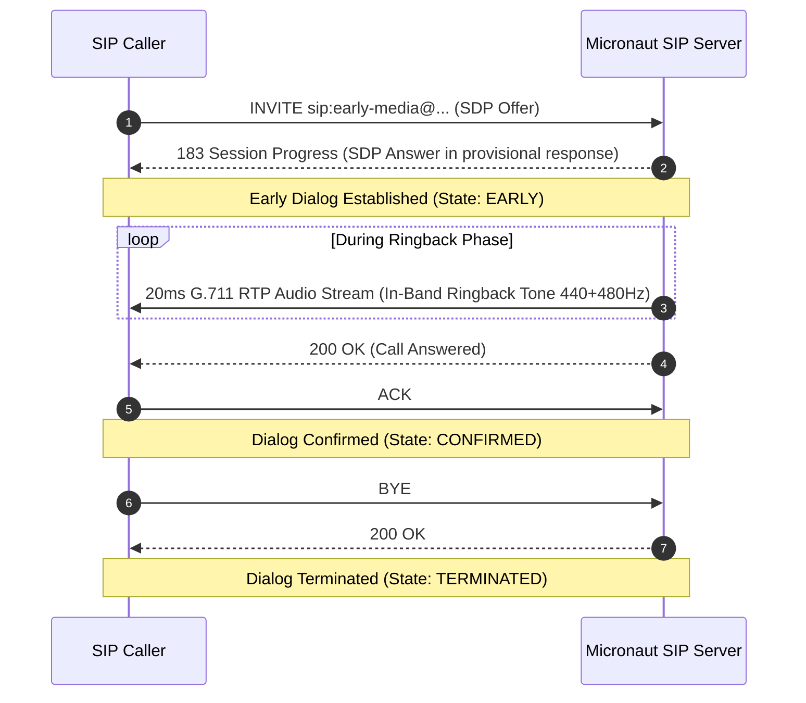

# Examples

### Modular SIP Controllers (`sip-app`)

In `sip-app`, distinct call flows are cleanly separated into dedicated, single-responsibility controllers extending [`BaseSipController`](../sip-app/src/main/java/net/pilgrim/controller/BaseSipController.java):

### 1. Two-Party Conversational Setup (`CallController`)

In [`sip-app/src/main/java/net/pilgrim/controller/CallController.java`](../sip-app/src/main/java/net/pilgrim/controller/CallController.java):

```java
@SipController
public class CallController extends BaseSipController {

    private static final SdpNegotiator SDP_NEGOTIATOR = new SdpNegotiator();
    private final RtpMediaManager rtpMediaManager;

    @Inject
    public CallController(RtpMediaManager rtpMediaManager,
                          @Nullable SipNettyServer sipServer,
                          @Nullable SipServerConfiguration serverConfig) {
        super(sipServer, serverConfig);
        this.rtpMediaManager = Optional.ofNullable(rtpMediaManager).orElseGet(RtpMediaManager::new);
    }

    // Handles INVITE: allocates dynamic Netty RTP port and negotiates SDP offer/answer
    @OnInvite
    public Flux<SipResponse> onInvite(SipRequest request,
                                      @SipCallId String callId,
                                      @SipBody String sdpOffer,
                                      SipSession session) {
        Optional.ofNullable(session).ifPresent(s -> s.handleInvite(request, sdpOffer));

        int localAudioPort = Optional.ofNullable(callId)
                .flatMap(id -> {
                    try {
                        return Optional.of(rtpMediaManager.createSession(id).getLocalPort());
                    } catch (Exception e) {
                        return Optional.empty();
                    }
                })
                .orElse(49170);

        SipResponse ringing = SipResponse.ringing(request);
        Optional.ofNullable(session).ifPresent(s -> s.handleProvisional(ringing));

        String advertisedIp = resolveAdvertisedIp();
        String contactUri = buildContactUri(request);

        SipResponse ok = Optional.ofNullable(sdpOffer)
                .filter(Predicate.not(String::isBlank))
                .map(offer -> SipResponse.ok(request, SDP_NEGOTIATOR.createAnswer(offer, localAudioPort, advertisedIp), "application/sdp"))
                .orElseGet(() -> SipResponse.ok(request, SDP_NEGOTIATOR.createOffer(localAudioPort, advertisedIp), "application/sdp"));
        ok.getHeaders().setContact(contactUri);

        return Flux.concat(
            Mono.just(ringing),
            Mono.just(ok).delayElement(Duration.ofMillis(300))
        );
    }

    // Handles ACK: marks dialog CONFIRMED and sends RTP probe frame
    @OnAck
    public void onAck(SipRequest request,
                      @SipCallId String callId,
                      @SipBody String ackSdpAnswer,
                      SipSession session) {
        Optional.ofNullable(session).ifPresent(s -> {
            var transition = s.handleAck(request, ackSdpAnswer);
            if (transition.isConfirmed()) {
                maybeSendRtpProbe(callId, s);
            }
        });
    }

    // Handles BYE: terminates active session and releases Netty RTP port pair
    @OnBye
    public Mono<SipResponse> onBye(SipRequest request,
                                   @SipCallId String callId,
                                   SipSession session) {
        Optional.ofNullable(session).ifPresent(s -> s.handleBye(request));
        rtpMediaManager.terminateSession(callId);
        return Mono.just(SipResponse.ok(request));
    }

    // Handles CANCEL: aborts in-flight call setup and tears down media session
    @OnCancel
    public void onCancel(SipRequest request,
                         @SipCallId String callId,
                         SipSession session) {
        Optional.ofNullable(session).ifPresent(s -> s.handleCancel(request));
        rtpMediaManager.terminateSession(callId);
    }

    // Handles PRACK (Provisional Response Acknowledgement, RFC 3262)
    @OnPrack
    public Mono<SipResponse> onPrack(SipRequest request,
                                     @SipCallId String callId,
                                     @SipHeader(value = "RAck", required = false) String rack,
                                     @SipBody String prackBody,
                                     SipSession session) {
        return Optional.ofNullable(session)
                .map(s -> s.handlePrack(request, rack, prackBody).isRejected()
                        ? SipResponse.transactionDoesNotExist(request)
                        : SipResponse.ok(request))
                .map(Mono::just)
                .orElseGet(() -> Mono.just(SipResponse.transactionDoesNotExist(request)));
    }

    // Handles OPTIONS capability discovery
    @OnOptions
    public SipResponse onOptions(SipRequest request) {
        SipResponse response = SipResponse.ok(request);
        response.getHeaders().set(SipHeaders.ALLOW, "INVITE, ACK, BYE, CANCEL, OPTIONS, REGISTER, MESSAGE, INFO, PRACK");
        response.getHeaders().set(SipHeaders.SUPPORTED, "replaces, 100rel");
        response.getHeaders().set(SipHeaders.RECV_INFO, "dtmf");
        return response;
    }
}
```

### 2. Early-Media & In-Band Ringback Controller (`EarlyMediaController`)

In [`sip-app/src/main/java/net/pilgrim/controller/EarlyMediaController.java`](../sip-app/src/main/java/net/pilgrim/controller/EarlyMediaController.java):

```java
@SipController
public class EarlyMediaController extends BaseSipController {

    // Handles Early Media: emits 183 Session Progress with SDP, streams ringback tone, then 200 OK
    @OnInvite("early-media")
    public Flux<SipResponse> onEarlyMediaInvite(SipRequest request,
                                                @SipCallId String callId,
                                                @SipBody String sdpOffer,
                                                SipSession session) {
        RtpMediaSession mediaSession = rtpMediaManager.createSession(callId);
        String sdpAnswer = SDP_NEGOTIATOR.createAnswer(sdpOffer, mediaSession.getLocalPort(), resolveAdvertisedIp());

        SipResponse sessionProgress = SipResponse.sessionProgress(request);
        sessionProgress.getHeaders().setContentType("application/sdp");
        sessionProgress.setBody(sdpAnswer);

        // Stream 20ms G.711 ringback tone packets over RTP during early dialog state
        byte[] ringbackPcm = generateRingbackTone(800);
        mediaSession.playAudio(ringbackPcm, null);

        SipResponse ok = SipResponse.ok(request, sdpAnswer, "application/sdp");
        return Flux.concat(
            Mono.just(sessionProgress),
            Mono.just(ok).delayElement(Duration.ofMillis(800))
        );
    }
}
```

### 3. Registration Controller (`RegistrationController`)

In [`sip-app/src/main/java/net/pilgrim/controller/RegistrationController.java`](../sip-app/src/main/java/net/pilgrim/controller/RegistrationController.java):

```java
@SipController
public class RegistrationController extends BaseSipController {

    // Handles REGISTER with URI injection and parameter binding
    @OnRegister
    public SipResponse onRegister(SipRequest request,
                                  @SipTo SipUri toUri,
                                  @SipParam(value = "transport", defaultValue = "udp") String transport,
                                  @SipHeader(value = "Contact", required = false) String contact) {
        SipResponse response = SipResponse.ok(request);
        Optional.ofNullable(contact).ifPresent(response.getHeaders()::setContact);
        Optional.ofNullable(toUri)
                .map(SipUri::getUser)
                .filter(Predicate.not(String::isBlank))
                .ifPresent(u -> response.getHeaders().set("X-Registered-User", u));
        response.getHeaders().set("X-Transport-Param", transport);
        response.getHeaders().set(SipHeaders.EXPIRES, "3600");
        return response;
    }
}
```

### 4. Messaging & DTMF Relay Controller (`DtmfController`)

In [`sip-app/src/main/java/net/pilgrim/controller/DtmfController.java`](../sip-app/src/main/java/net/pilgrim/controller/DtmfController.java):

```java
@SipController
public class DtmfController extends BaseSipController {

    // Handles instant MESSAGE (RFC 3428)
    @OnMessage
    public Mono<SipResponse> onMessage(SipRequest request,
                                       @SipFrom String from,
                                       @SipBody String messageBody,
                                       @SipDtmf DtmfSignal dtmf,
                                       SipSession session) {
        return Optional.ofNullable(dtmf)
                .map(signal -> {
                    SipResponse ok = SipResponse.ok(request);
                    ok.getHeaders().set("X-Received-DTMF", String.valueOf(signal.getDigit()));
                    return Mono.just(ok);
                })
                .orElseGet(() -> Mono.just(SipResponse.ok(request)));
    }

    // Handles mid-dialog INFO (RFC 2976 / RFC 6086) DTMF relay signaling
    @OnInfo
    public Mono<SipResponse> onInfo(SipRequest request,
                                    @SipCallId String callId,
                                    @SipFrom String from,
                                    @SipDtmf DtmfSignal dtmf,
                                    SipSession session) {
        return Optional.ofNullable(dtmf)
                .map(signal -> {
                    Optional.ofNullable(session).ifPresent(s -> recordDtmfInSession(s, signal));
                    SipResponse ok = SipResponse.ok(request);
                    ok.getHeaders().set("X-Received-DTMF", String.valueOf(signal.getDigit()));
                    return Mono.just(ok);
                })
                .orElseGet(() -> Mono.just(SipResponse.ok(request)));
    }
}
```

---

## Example RFC 4240 NetAnn Announcement Controller (`micronaut-netann`)

In [`micronaut-netann/src/main/java/net/pilgrim/netann/controller/AnnouncementController.java`](../micronaut-netann/src/main/java/net/pilgrim/netann/controller/AnnouncementController.java):

```java
@SipController
public class AnnouncementController {

    private final RtpMediaManager rtpMediaManager;
    private final AnnouncementAudioLoader audioLoader;
    private final SdpNegotiator sdpNegotiator = new SdpNegotiator();
    private final Map<String, AnnouncementPlayer> activePlayers = new ConcurrentHashMap<>();

    // Handles RFC 4240 Announcement Service (sip:annc@...)
    @OnInvite("annc")
    public Mono<SipResponse> onAnnouncementInvite(SipRequest request,
                                                  @SipCallId String callId,
                                                  @SipBody String sdpOffer,
                                                  SipSession session) {
        // 1. Parse announcement parameters (play=, repeat=, delay=, duration=)
        AnnouncementParams params = AnnouncementParams.parse(request.getUri());

        // 2. Validate mandatory play= parameter (RFC 4240 §2 -> 400 Bad Request)
        if (params.getPlay() == null || params.getPlay().isBlank()) {
            return Mono.just(request.createResponse(SipStatus.BAD_REQUEST, "Mandatory play parameter missing"));
        }

        // 3. Load audio prompt (tone, file, classpath, or URL -> 404 Not Found on missing)
        byte[] pcmAudio;
        try {
            pcmAudio = audioLoader.loadAudio(params.getPlay());
        } catch (FileNotFoundException e) {
            return Mono.just(request.createResponse(SipStatus.NOT_FOUND, "Announcement content not found"));
        }

        // 4. Allocate Netty RTP media session and negotiate SDP Answer
        RtpMediaSession mediaSession = rtpMediaManager.createSession(callId);
        String sdpAnswer = sdpNegotiator.createAnswer(sdpOffer != null ? sdpOffer : "", mediaSession.getLocalPort());

        session.setState(SipSession.State.EARLY);
        session.setAttribute("anncParams", params);
        session.setAttribute("pcmAudio", pcmAudio);

        return Mono.just(SipResponse.ok(request, sdpAnswer, "application/sdp"));
    }

    // Handles ACK: marks session CONFIRMED and initiates 20ms RTP audio streaming
    @OnAck("annc")
    public void onAnnouncementAck(SipRequest request,
                                  @SipCallId String callId,
                                  SipSession session) {
        session.setState(SipSession.State.CONFIRMED);

        AnnouncementPlayer player = new AnnouncementPlayer(
                callId, session, rtpMediaSession, remoteAudioAddress, pcmAudio, params,
                () -> terminateAnnouncementCall(callId, session) // Auto-BYE callback on completion
        );
        activePlayers.put(callId, player);
        player.start();
    }

    // Unhandled NetAnn services (e.g. conf=, dialog) rejected per RFC 4240 §2
    @OnInvite
    public Mono<SipResponse> onUnsupportedService(SipRequest request) {
        return Mono.just(request.createResponse(SipStatus.NOT_ACCEPTABLE_HERE, "Unsupported NetAnn service"));
    }

    // Handles BYE: caller hung up early; halts playback and releases resources
    @OnBye
    public Mono<SipResponse> onBye(SipRequest request, @SipCallId String callId) {
        stopPlayer(callId);
        rtpMediaManager.terminateSession(callId);
        return Mono.just(SipResponse.ok(request));
    }
}
```

---

## Example SDP Offer/Answer Negotiation (`micronaut-sdp`)

Using [`SdpNegotiator`](../micronaut-sdp/src/main/java/net/pilgrim/sip/sdp/SdpNegotiator.java) and [`SdpParser`](../micronaut-sdp/src/main/java/net/pilgrim/sip/sdp/SdpParser.java):

```java
SdpNegotiator negotiator = new SdpNegotiator();

// 1. Generate an initial SDP offer for an allocated RTP port (e.g. port 10002)
String offer = negotiator.createOffer(10002);
/*
v=0
o=- 1791052800 1 IN IP4 0.0.0.0
s=MicronautSIP
c=IN IP4 0.0.0.0
t=0 0
m=audio 10002 RTP/AVP 0 8
a=rtpmap:0 PCMU/8000
a=rtpmap:8 PCMA/8000
a=sendrecv
*/

// 2. Generate a matching answer for an incoming offer on a local media port (e.g. port 10004)
String answer = negotiator.createAnswer(offer, 10004);

// 3. Inspect parsed SDP message fields
SdpParser parser = new SdpParser();
SdpMessage message = parser.parse(answer);
int remoteAudioPort = message.getAudioPort();
String direction = message.getDirection(); // "sendrecv", "sendonly", "recvonly", "inactive"
```

---

## Example Reactive RTP Streaming (`micronaut-rtp`)

Using Netty pipeline transport with [`RtpNettySender`](../micronaut-rtp/src/main/java/net/pilgrim/sip/rtp/transport/RtpNettySender.java), [`RtpNettyReceiver`](../micronaut-rtp/src/main/java/net/pilgrim/sip/rtp/transport/RtpNettyReceiver.java), and G.711 codec transcoding:

```java
// 1. Initialize receiver on loopback/bind address
InetSocketAddress bindAddr = new InetSocketAddress("127.0.0.1", 10004);
try (RtpNettyReceiver receiver = new RtpNettyReceiver(bindAddr)) {

    // 2. Reactively subscribe to inbound RTP packets
    receiver.incomingPackets().subscribe(inbound -> {
        RtpPacket packet = inbound.packet();
        System.out.println("Received RTP packet seq=" + packet.getSequenceNumber()
                + " ts=" + packet.getTimestamp()
                + " from " + inbound.senderAddress());
    });

    // 3. Stream 16-bit linear PCM audio frames encoded via G.711 PCMU (payload type 0)
    InetSocketAddress target = new InetSocketAddress("127.0.0.1", receiver.getLocalPort());
    RtpPacketizer packetizer = new RtpPacketizer(0, 8000, 1, 0); // PT 0, 8000 Hz, init seq=1, init ts=0

    try (RtpNettySender sender = new RtpNettySender(target, packetizer)) {
        byte[] pcm16Frame = new byte[320]; // 160 16-bit PCM samples = 20ms frame
        sender.sendPcm16LeFrame(pcm16Frame, new G711UlawCodec(), true)
              .block(Duration.ofSeconds(1));
    }
}
```

---

## Example Reactive Filter (`@SipFilter`)

Implement [`SipServerFilter`](../micronaut-sip/src/main/java/net/pilgrim/sip/filter/SipServerFilter.java) with `@Singleton` or `@SipFilter`:

```java
@Singleton
@SipFilter(methods = {SipMethod.INVITE, SipMethod.REGISTER}, order = -100)
public class CustomSecurityFilter implements SipServerFilter {

    @Override
    public Publisher<SipResponse> doFilter(SipRequest request, SipFilterChain chain) {
        // Inspect or validate request
        if (!request.getHeaders().contains("X-Auth-Token")) {
            return Mono.just(request.createResponse(403, "Forbidden - Missing Auth Token"));
        }

        // Add correlation header to request before passing down
        request.getHeaders().set("X-Correlation-Id", UUID.randomUUID().toString());

        // Process downstream and mutate response reactively
        return Flux.from(chain.proceed(request))
                .map(response -> {
                    response.getHeaders().set("X-Filtered-By", "CustomSecurityFilter");
                    return response;
                });
    }
}
```

---

## Example BDD Feature Specifications (`:micronaut-sip-bdd`)

The `:micronaut-sip-bdd` module enables defining call scenarios in standard Gherkin syntax that execute over real Netty sockets.

### 1. Two-Party Audio Call with SDP Offer/Answer (RFC 3261)

```gherkin
Feature: Basic Audio Call Setup and Teardown (RFC 3261)

  Scenario: Successful two-party call between Alice and Bob
    Given a SIP endpoint "Alice"
    And a SIP endpoint "Bob"

    When "Alice" sends an "INVITE" to "Bob" with SDP offer:
      | media | proto   | port | codec |
      | audio | RTP/AVP | 4000 | PCMU  |

    Then "Bob" receives an "INVITE" request within 2 seconds
    And header "From" contains parameter "tag"
    And header "Contact" contains parameter "sip:alice@"

    When "Bob" responds with "180 Ringing"
    Then "Alice" receives "180 Ringing" within 2 seconds

    When "Bob" responds with "200 OK" with SDP answer:
      | media | proto   | port | codec |
      | audio | RTP/AVP | 5000 | PCMU  |

    Then "Alice" receives "200 OK" within 2 seconds
    And header "Contact" contains parameter "sip:bob@"
    And SDP negotiated codec is "PCMU"
    And the dialog between "Alice" and "Bob" is in state "CONFIRMED"

    When "Alice" sends an ACK to "Bob"
    Then "Bob" receives an "ACK" request within 1 second

    # Teardown
    When "Alice" sends a BYE to "Bob"
    Then "Bob" receives a "BYE" request within 2 seconds

    When "Bob" responds with "200 OK"
    Then "Alice" receives "200 OK" within 2 seconds
    And the dialog between "Alice" and "Bob" is in state "TERMINATED"
```

### 2. Digest Authentication Challenge & Retry (RFC 2617)

```gherkin
Feature: SIP Digest Authentication Challenge and Retry (RFC 2617)

  Scenario: Registration challenged with 401 Unauthorized and retried with credentials
    Given a SIP endpoint "Alice" with username "alice" and password "secretpass"
    And a SIP endpoint "Registrar"

    # Step 1: Initial unauthenticated REGISTER
    When "Alice" sends an "REGISTER" to "Registrar" with headers:
      | Header-Name | Value |
      | Expires     | 3600  |

    Then "Registrar" receives an "REGISTER" request within 2 seconds

    # Step 2: Challenge issued by Registrar
    When "Registrar" responds with "401 Unauthorized" with headers:
      | Header-Name      | Value                                                                      |
      | WWW-Authenticate | Digest realm="sip.domain", nonce="7d8f921e4a", qop="auth", algorithm=MD5   |

    Then "Alice" receives "401 Unauthorized" within 2 seconds
    And header "WWW-Authenticate" matches regex "Digest realm=.*, nonce=.*"

    # Step 3: Alice retries with calculated MD5 digest
    When "Alice" retries the last request with valid digest credentials
    Then "Registrar" receives an "REGISTER" request within 2 seconds
    And header "Authorization" matches regex "Digest username=\"alice\", realm=\"sip.domain\""

    # Step 4: Registrar accepts authenticated REGISTER
    When "Registrar" responds with "200 OK"
    Then "Alice" receives "200 OK" within 2 seconds
```

### 3. Reliable Provisional Responses & PRACK Handshake (RFC 3262)

```gherkin
Feature: Reliable Provisional Responses and PRACK (RFC 3262)

  Scenario: 183 Session Progress acknowledged via PRACK
    Given a SIP endpoint "Alice"
    And a SIP endpoint "Bob"

    When "Alice" sends an "INVITE" to "Bob" with headers:
      | Header-Name | Value  |
      | Supported   | 100rel |

    Then "Bob" receives an "INVITE" request within 2 seconds

    When "Bob" responds with "183 Session Progress" with headers:
      | Header-Name | Value  |
      | Require     | 100rel |
      | RSeq        | 1      |

    Then "Alice" receives "183 Session Progress" within 2 seconds
    And header "RSeq" equals "1"

    When "Alice" sends PRACK acknowledging the provisional response to "Bob"
    Then "Bob" receives an "PRACK" request within 2 seconds
    And header "RAck" contains parameter "1"

    When "Bob" responds with "200 OK"
    Then "Alice" receives "200 OK" within 2 seconds
```

### 4. Early Media & In-Band Ringback (RFC 3960 / RFC 3261)



```gherkin
Feature: Early Media and Session Progress (RFC 3960 / RFC 3261)

  Scenario: Early media negotiated via 183 Session Progress with SDP
    Given a SIP endpoint "Alice"
    And a SIP endpoint "Bob"

    When "Alice" sends an "INVITE" to "Bob" with SDP offer:
      | media | proto   | port | codec |
      | audio | RTP/AVP | 4000 | PCMU  |

    Then "Bob" receives an "INVITE" request within 2 seconds
    And header "From" contains parameter "tag"
    And the dialog between "Alice" and "Bob" is in state "EARLY"

    When "Bob" responds with "183 Session Progress" with SDP answer:
      | media | proto   | port | codec |
      | audio | RTP/AVP | 5000 | PCMU  |

    Then "Alice" receives "183 Session Progress" within 2 seconds
    And header "Content-Type" equals "application/sdp"
    And SDP negotiated codec is "PCMU"
    And the dialog between "Alice" and "Bob" is in state "EARLY"

    When "Bob" responds with "200 OK"
    Then "Alice" receives "200 OK" within 2 seconds
    And the dialog between "Alice" and "Bob" is in state "CONFIRMED"

    When "Alice" sends an ACK to "Bob"
    Then "Bob" receives an "ACK" request within 1 second

    # Teardown
    When "Alice" sends a BYE to "Bob"
    Then "Bob" receives a "BYE" request within 2 seconds
    When "Bob" responds with "200 OK"
    Then "Alice" receives "200 OK" within 2 seconds
    And the dialog between "Alice" and "Bob" is in state "TERMINATED"
```
