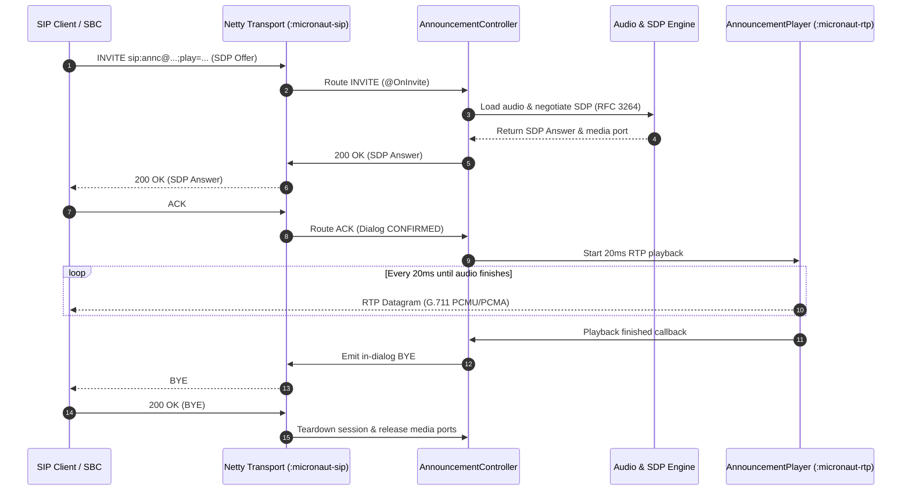
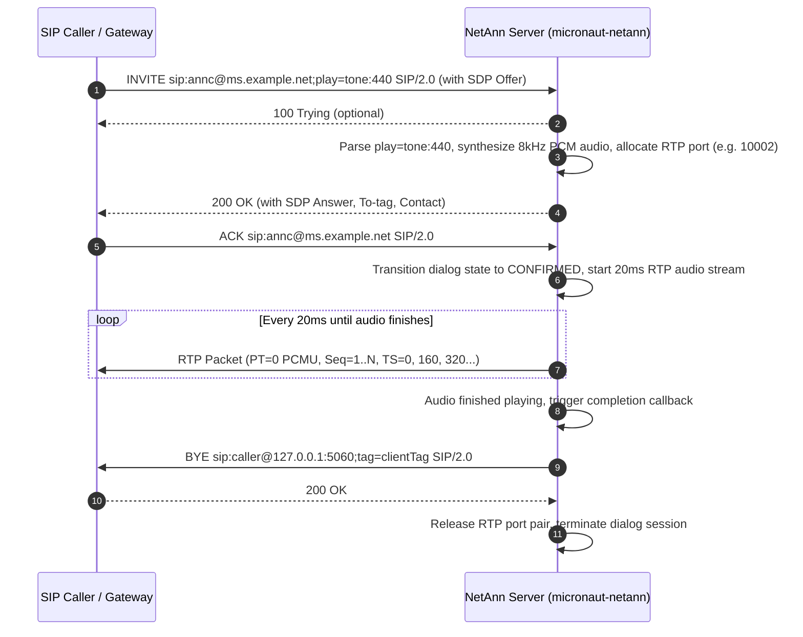
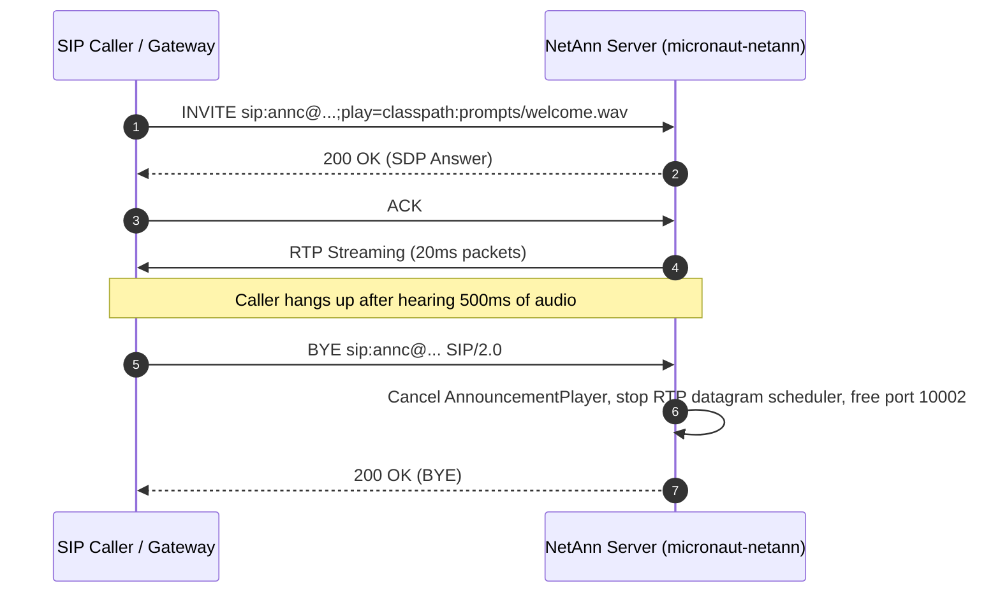
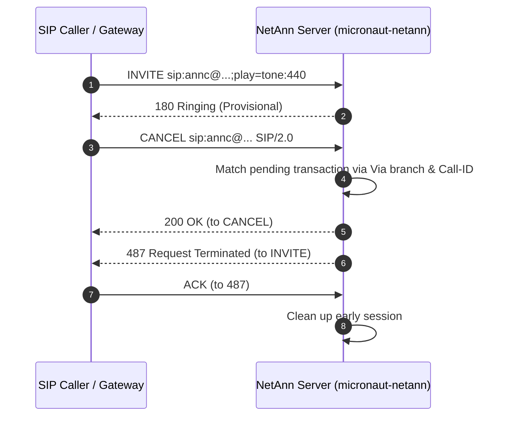
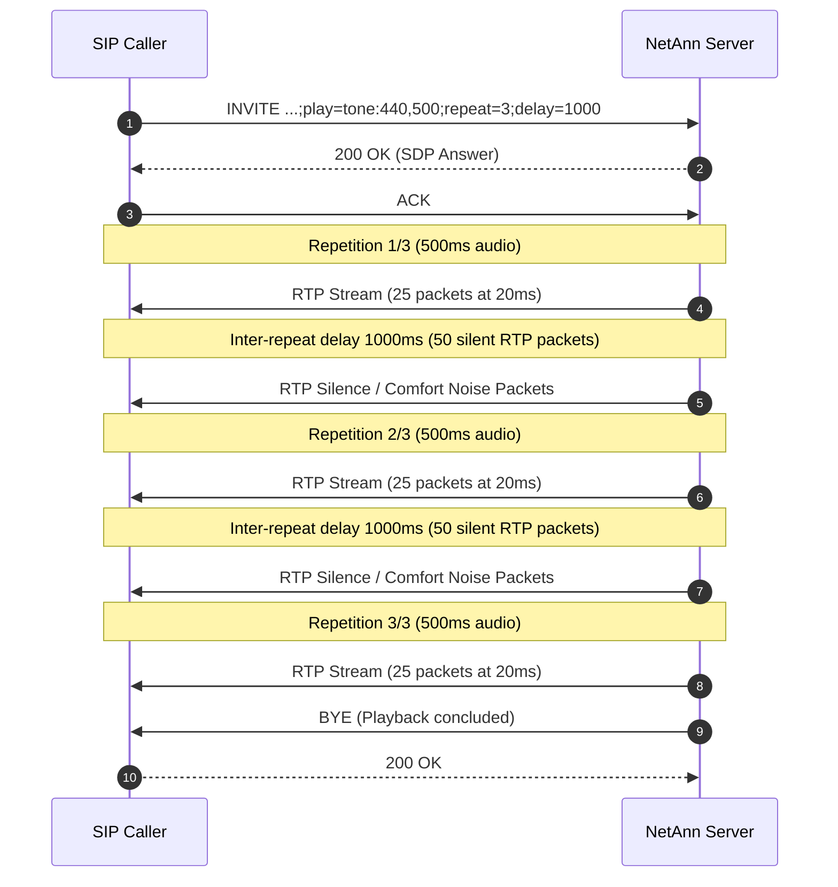
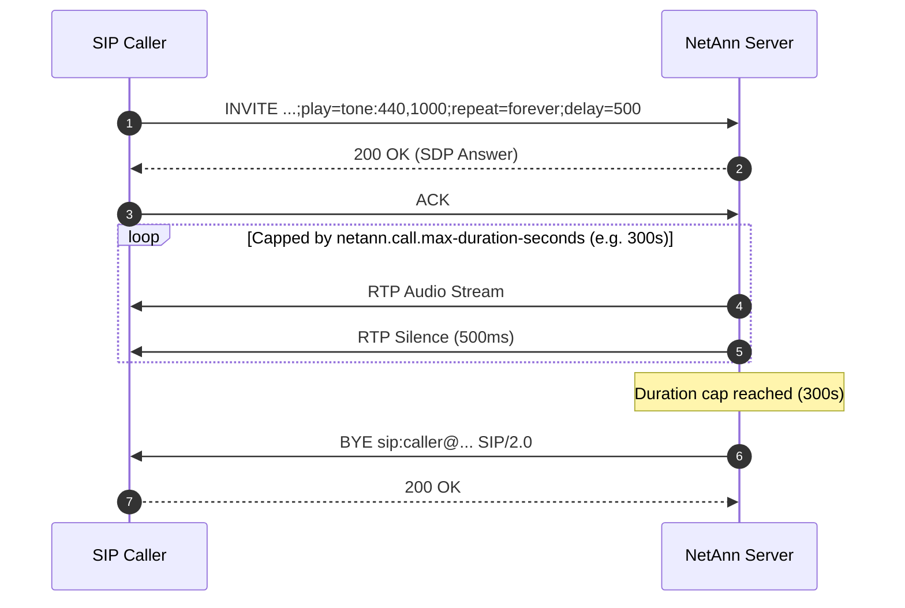
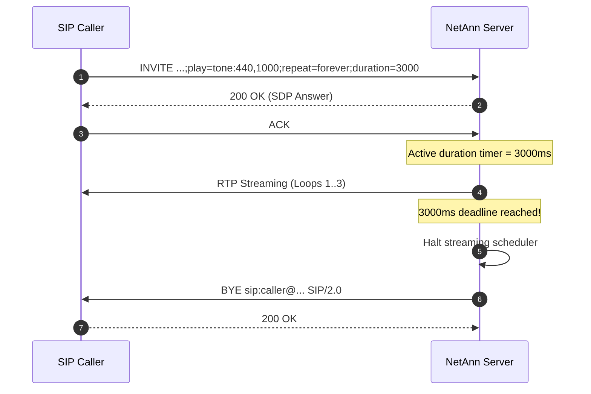
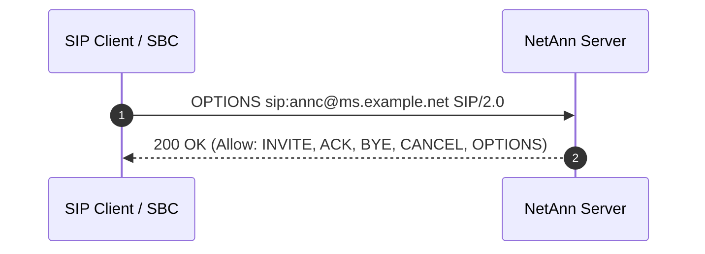
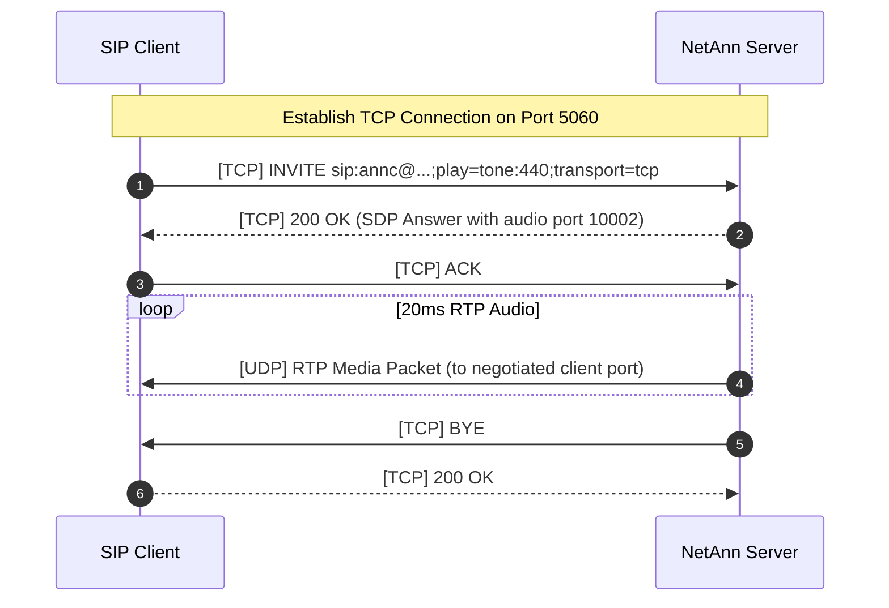
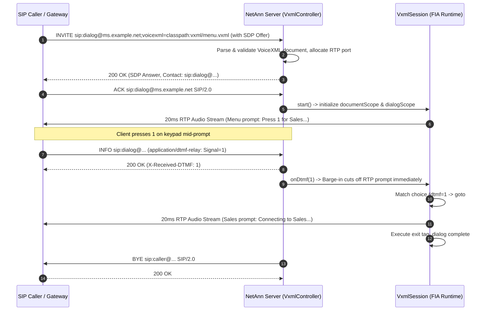

# RFC 4240 NetAnn Announcement Service: Architecture & Call Flows

NetAnn is implemented as a set of reactive controllers inside `:sip-app` built on top of `:micronaut-sip`, `:micronaut-sdp`, and `:micronaut-rtp`. It implements the **Announcement Service (`annc`)** defined by [**RFC 4240: Basic Network Media Services with SIP**](https://datatracker.ietf.org/doc/html/rfc4240).

### Quick Reference

- **Standard**: [RFC 4240: Basic Network Media Services with SIP](https://datatracker.ietf.org/doc/html/rfc4240)
- **Application Module**: `:sip-app`
- **Controller**: [`AnnouncementController`](../sip-app/src/main/java/net/pilgrim/netann/controller/AnnouncementController.java)
- **Audio Loader**: [`AnnouncementAudioLoader`](../sip-app/src/main/java/net/pilgrim/netann/service/AnnouncementAudioLoader.java)
- **RTP Streamer**: [`AnnouncementPlayer`](../sip-app/src/main/java/net/pilgrim/netann/service/AnnouncementPlayer.java)
- **Kubernetes Manifests**: [`k8s/sip-app/`](../k8s/sip-app/)
- **Integration Test Suite**: [`AnnouncementIntegrationTest`](../sip-app/src/test/java/net/pilgrim/netann/AnnouncementIntegrationTest.java)
- **Performance Benchmark**: [1-Hour Sustained Load Benchmark (180,000 calls @ 50 cps, ~100 concurrent streams)](PERFORMANCE.md#1-hour-sustained-load--concurrency-benchmark-micronaut-netann)

### Key Call Flows Documented

1. **Flow 1: Standard Announcement Playback & Server Auto-BYE Teardown** (full sequence and wire trace)
2. **Flow 2: Caller Early Teardown (`BYE` during streaming)**
3. **Flow 3: Call Setup Cancellation (`CANCEL`)**
4. **Flow 4: Repeat Loop with Inter-Prompt Delay (`repeat=3;delay=1000`)**
5. **Flow 5: Continuous Loop (`repeat=forever`)**
6. **Flow 6: Duration-Capped Playback (`duration=5000`)**
7. **Flow 7: Error Conditions (400, 404, 488)**
8. **Flow 8: Capability Query (`OPTIONS`)**
9. **Flow 9: Persistent TCP Signaling Transport**

---

## 1. Architectural Overview



---

## 2. RFC 4240 Request-URI Grammar & Parameters

The announcement service is invoked by directing an `INVITE` request to a Request-URI whose user part is `annc`:

```
sip:annc@<media-server-host>[:<port>];play=<url>[;repeat=<count>][;delay=<ms>][;duration=<ms>][;locale=<lang>][;content-type=<mime>]
```

### Supported Parameters

| Parameter | Type / Format | Default | Description | RFC Reference |
| :--- | :--- | :---: | :--- | :--- |
| `play` | URI / String | **Mandatory** | URL or prompt identifier indicating the audio content to play. Missing parameter triggers `400 Bad Request`. | RFC 4240 §3.1 |
| `repeat` | Integer / `"forever"` | `1` | Number of times the announcement should be played sequentially. Value `-1` or `"forever"` loops continuously until caller hangs up. | RFC 4240 §3.2 |
| `delay` | Long (milliseconds) | `0` | Delay between consecutive announcement repetitions in milliseconds. Zero inserts no silence between loops. | RFC 4240 §3.2 |
| `duration` | Long (milliseconds) | Unlimited | Maximum duration the media server will play before prematurely terminating the call with an in-dialog `BYE`. | RFC 4240 §3.2 |
| `locale` | RFC 3066 language code | `en` | Preferred language or regional dialect hint for selecting localized audio assets (e.g. `en-US`, `de-DE`). | RFC 4240 §3.4 |
| `content-type` | MIME type | `audio/x-wav` | MIME type hint for audio container decoding. | RFC 4240 §3.5 |

### Supported Audio Prompt Schemes (`play=`)

1. **Synthetic Tones**:
   `tone:<frequency_hz>[,<duration_ms>]` or `builtin:<frequency_hz>`
   - Example: `play=tone:440,1000` (plays a 440 Hz A-note for 1000 ms)
   - Example: `play=tone:480,500` (plays a 480 Hz tone for 500 ms)
2. **Classpath Resources**:
   `classpath:<path>` or `/prompts/<name>.wav`
   - Example: `play=classpath:prompts/welcome.wav`
3. **Provisioned Prompts**:
   `/provisioned/<id>` or `provisioned:<id>`
   - Example: `play=/provisioned/welcome`
4. **Filesystem Files**:
   `file://<path>` or direct filesystem paths
   - Example: `play=file:///var/prompts/ivr-greeting.wav`
5. **Remote HTTP / HTTPS Audio**:
   `http://<host>/<path>` or `https://<host>/<path>`
   - Example: `play=http://audio-storage.internal/announcements/system-update.wav`

All audio sources are decoded into **8000 Hz, 16-bit mono signed linear PCM** and packetized into standard **20ms frames** (160 samples per frame) encoded as **ITU-T G.711 $\mu$-law (PCMU / payload type 0)** or **A-law (PCMA / payload type 8)**.

---

## 3. NetAnn Call Flows

### Call Flow 1: Standard Announcement Playback & Server Auto-`BYE` Teardown

In accordance with RFC 4240 §2, once the requested audio prompt finishes playing, the media server automatically initiates dialog termination by sending an in-dialog `BYE` request to the client.



#### SIP Signaling Trace

**1. Client sends initial `INVITE` with SDP offer:**
```http
INVITE sip:annc@ms.example.net:5060;play=tone:440,1000 SIP/2.0
Via: SIP/2.0/UDP 127.0.0.1:5062;branch=z9hG4bK-inv-101;rport
From: <sip:caller@127.0.0.1:5062>;tag=caller-tag-1
To: <sip:annc@ms.example.net:5060>
Call-ID: annc-call-882910@127.0.0.1
CSeq: 1 INVITE
Contact: <sip:caller@127.0.0.1:5062>
Max-Forwards: 70
Content-Type: application/sdp
Content-Length: 172

v=0
o=Caller 1000 1000 IN IP4 127.0.0.1
s=VoiceCall
c=IN IP4 127.0.0.1
t=0 0
m=audio 30000 RTP/AVP 0 8
a=rtpmap:0 PCMU/8000
a=rtpmap:8 PCMA/8000
a=sendrecv
```

**2. Server responds with `200 OK` carrying SDP answer:**
```http
SIP/2.0 200 OK
Via: SIP/2.0/UDP 127.0.0.1:5062;branch=z9hG4bK-inv-101;rport=5062;received=127.0.0.1
From: <sip:caller@127.0.0.1:5062>;tag=caller-tag-1
To: <sip:annc@ms.example.net:5060>;tag=9dfa82c1b470
Call-ID: annc-call-882910@127.0.0.1
CSeq: 1 INVITE
Contact: <sip:127.0.0.1:5060;transport=udp>
Allow: INVITE, ACK, BYE, CANCEL, OPTIONS
Content-Type: application/sdp
Content-Length: 175

v=0
o=MicronautSIP 1791052800 1 IN IP4 127.0.0.1
s=MicronautNetAnn
c=IN IP4 127.0.0.1
t=0 0
m=audio 10002 RTP/AVP 0 8
a=rtpmap:0 PCMU/8000
a=rtpmap:8 PCMA/8000
a=sendrecv
```

**3. Client confirms with `ACK`:**
```http
ACK sip:annc@ms.example.net:5060 SIP/2.0
Via: SIP/2.0/UDP 127.0.0.1:5062;branch=z9hG4bK-ack-102
From: <sip:caller@127.0.0.1:5062>;tag=caller-tag-1
To: <sip:annc@ms.example.net:5060>;tag=9dfa82c1b470
Call-ID: annc-call-882910@127.0.0.1
CSeq: 1 ACK
Max-Forwards: 70
Content-Length: 0
```

**4. RTP Audio Transmission:**
- 50 consecutive UDP datagrams emitted at 20ms intervals to `127.0.0.1:30000`.
- Each datagram: 12-byte RFC 3550 RTP header + 160 bytes G.711 $\mu$-law audio payload.

**5. Server initiates teardown via in-dialog `BYE` upon completion:**
```http
BYE sip:caller@127.0.0.1:5062 SIP/2.0
Via: SIP/2.0/UDP 127.0.0.1:5060;branch=z9hG4bK-bye-991
From: <sip:annc@ms.example.net:5060>;tag=9dfa82c1b470
To: <sip:caller@127.0.0.1:5062>;tag=caller-tag-1
Call-ID: annc-call-882910@127.0.0.1
CSeq: 101 BYE
Max-Forwards: 70
Content-Length: 0
```

**6. Client returns `200 OK`:**
```http
SIP/2.0 200 OK
Via: SIP/2.0/UDP 127.0.0.1:5060;branch=z9hG4bK-bye-991
From: <sip:annc@ms.example.net:5060>;tag=9dfa82c1b470
To: <sip:caller@127.0.0.1:5062>;tag=caller-tag-1
Call-ID: annc-call-882910@127.0.0.1
CSeq: 101 BYE
Content-Length: 0
```

---

### Call Flow 2: Caller Early Teardown (`BYE` during streaming)

When a caller hangs up prior to announcement completion, the server immediately stops audio transmission, terminates background streaming threads, and frees allocated UDP port resources.



---

### Call Flow 3: Call Setup Cancellation (`CANCEL`)

When the caller decides to abort the call setup before the server has emitted a final response (`200 OK`), the client transmits a `CANCEL` matching the pending transaction.



---

### Call Flow 4: Repeat Loop with Inter-Prompt Delay (`repeat=3;delay=1000`)

The client requests that the announcement be repeated 3 times with 1 second (1000 ms) of silence inserted between each repetition:
`sip:annc@ms.example.net;play=tone:440,500;repeat=3;delay=1000`



---

### Call Flow 5: Continuous Loop (`repeat=forever`) & Local Resource Capping

RFC 4240 §3.2 specifies that `repeat=forever` loops an announcement continuously, but explicitly notes: *"Media server implementations often enforce a maximum duration or repetition count to prevent resource exhaustion."*

Micronaut NetAnn enforces a local maximum duration ceiling (`netann.call.max-duration-seconds`, default: 300 seconds / 5 minutes) and a maximum repetition limit (`netann.call.max-repeat-count`, default: 100) to protect RTP ports and system memory against abandoned or malicious calls. When this cap is reached, the server self-terminates playback and hangs up with `BYE`.



---

### Call Flow 6: Duration-Capped Playback (`duration=5000`)

When a `duration` parameter is supplied, the media server enforces a hard time ceiling. If audio playback or looping would otherwise exceed this duration, the server terminates the stream at the deadline and emits an in-dialog `BYE`.



---

### Call Flow 7: Error Conditions & RFC 4240 Error Semantics

#### 1. Missing Mandatory `play=` Parameter (`400 Bad Request`)
Per RFC 4240 §3, the `play` parameter is mandatory for the announcement service. Any request lacking `play` is rejected immediately prior to session creation:

```http
INVITE sip:annc@ms.example.net:5060 SIP/2.0
Via: SIP/2.0/UDP 127.0.0.1:5062;branch=z9hG4bK-inv-400
...

SIP/2.0 400 Bad Request
Reason: Mandatory play parameter missing
Content-Length: 0
```

#### 2. Non-Existent Announcement Resource (`404 Not Found`)
When the requested URL, prompt identifier, or filesystem path cannot be resolved:

```http
INVITE sip:annc@ms.example.net:5060;play=file:///nonexistent/audio.wav SIP/2.0
Via: SIP/2.0/UDP 127.0.0.1:5062;branch=z9hG4bK-inv-404
...

SIP/2.0 404 Not Found
Reason: Announcement content not found
Content-Length: 0
```

#### 3. Unsupported NetAnn Service (`488 Not Acceptable Here`)
Per RFC 4240 §2, if a client requests an unhandled service indicator (e.g., `conf`, `dialog`) or an unknown user identifier:

```http
INVITE sip:conf@ms.example.net:5060;conf=1234 SIP/2.0
Via: SIP/2.0/UDP 127.0.0.1:5062;branch=z9hG4bK-inv-488
...

SIP/2.0 488 Not Acceptable Here
Reason: Unsupported NetAnn service
Content-Length: 0
```

#### 4. SSRF & Prompt Security Violation (`403 Forbidden`)
If a caller specifies an HTTP(S) URL targeting private or metadata IP ranges (e.g. `127.0.0.1`, `10.0.0.0/8`, `169.254.169.254`), or attempts path traversal (`..`):

```http
INVITE sip:annc@ms.example.net:5060;play=http://169.254.169.254/latest/meta-data SIP/2.0
Via: SIP/2.0/UDP 192.0.2.1:5062;branch=z9hG4bK-inv-ssrf
...

SIP/2.0 403 Forbidden
Reason: Forbidden: SSRF blocked: host '169.254.169.254' resolves to restricted address: 169.254.169.254
Content-Length: 0
```

#### 5. Concurrency & Per-IP Schedular Saturation (`503 Service Unavailable`)
If total active calls exceed `netann.call.max-active-announcements` or a single client IP exceeds `netann.call.max-announcements-per-ip`:

```http
INVITE sip:annc@ms.example.net:5060;play=builtin:tone:440,1000 SIP/2.0
Via: SIP/2.0/UDP 192.0.2.1:5062;branch=z9hG4bK-inv-overload
...

SIP/2.0 503 Service Unavailable
Retry-After: 10
Content-Length: 0
```

---

### Call Flow 8: Capability Query (`OPTIONS`)

Clients or SBCs can interrogate the media server's supported methods and RFC 4240 capabilities using `OPTIONS`:



---

### Call Flow 9: Persistent TCP Signaling Transport

`micronaut-netann` transparently supports TCP signaling (RFC 3261 §18.1.1) alongside UDP. In this mode, SIP signaling messages flow over a persistent TCP stream socket, while 20ms audio frames stream asynchronously over UDP:



---

## 4. GraalVM Native Image Compilation

`micronaut-netann` is fully configured for Ahead-of-Time (AOT) GraalVM Native Image compilation with **zero reflection**, instantaneous startup, and reduced memory footprint:

- **Startup Latency**: ~15–20 ms (compared to 650 ms on JVM)
- **Idle Memory Footprint**: ~44 MB RSS (compared to 190 MB on JVM)
- **Standalone Binary**: Single executable containing the Netty networking stack, Project Reactor scheduler, audio codecs, and bundled prompts.

### Build Executable
```bash
./gradlew :sip-app:nativeCompile
```

Binary location:
```bash
./sip-app/build/native/nativeCompile/sip-app
```

### Build Native Container
```bash
./gradlew :sip-app:dockerBuildNative
```

---

## 5. Kubernetes Deployment

The application includes production-ready manifests in [`k8s/sip-app/`](../k8s/sip-app/):

- **Deployment**: Configured with `hostNetwork: true` and `dnsPolicy: ClusterFirstWithHostNet` for direct high-throughput dynamic RTP port streaming (`10000–20000`), Downward API injection for `SIP_SERVER_ADVERTISED_IP`, liveness (`:8080/health/liveness`), readiness (`:8080/health/readiness`), startup probes, non-root security context, and resource boundaries.
- **Service**: Exposes port `5060/UDP`, `5060/TCP`, `8080/TCP`, and representative RTP UDP media ports (`10000..10010`) with `sessionAffinity: ClientIP`.
- **ConfigMap**: Configurable server names, rate limits, audio port bounds, NetAnn security caps, and prompt locations.
- **Prompt Volume**: Mounted storage volume (`/var/netann/prompts`) for provisioning custom audio announcements.

To deploy via Kustomize:
```bash
kubectl apply -k k8s/
```

---

## 6. Security Controls & Non-Blocking Reactive Architecture

Production media servers face severe vulnerabilities if prompts or call durations are unconstrained. `micronaut-netann` implements multi-layer defense-in-depth:

### 1. SSRF Guardrails (`AnnouncementAudioLoader`)
- **Disabled by Default**: HTTP(S) prompt loading is disabled by default (`netann.audio.http-enabled=false`).
- **Host Allowlisting**: When enabled, optional `netann.audio.allowed-hosts` restricts remote fetching to designated internal/partner CDNs.
- **DNS Pre-Resolution IP Inspection**: URLs are pre-resolved and inspected before connection initiation. Connections to loopback (`127.0.0.0/8`, `::1`), private networks (RFC 1918: `10.0.0.0/8`, `172.16.0.0/12`, `192.168.0.0/16`), link-local (`169.254.0.0/16`), and cloud metadata (`169.254.169.254`) are blocked and return `403 Forbidden`.
- **Redirects Disabled**: `HttpURLConnection.setInstanceFollowRedirects(false)` prevents attackers from using open redirects to bypass SSRF validation.
- **Connect & Read Timeouts**: Enforces 3s connect and 5s read timeouts.
- **Memory Exhaustion Guard**: Streams are bounded to `netann.audio.max-audio-size-bytes` (default: 10 MB); oversized files throw an exception before memory exhaustion.
- **Filesystem Jail & Traversal**: Paths containing `..` or residing outside the configured prompt directory are rejected with `SecurityException`.

### 2. Duration & Repeat Caps (`AnnouncementPlayer`)
- **Indefinite Hold Prevention**: Calls omitting `duration` or setting `repeat=forever` are capped at `netann.call.max-duration-seconds` (default: 300 seconds / 5 minutes) and `netann.call.max-repeat-count` (default: 100). Callers cannot monopolize RTP ports indefinitely.
- **Auto-Teardown**: Upon reaching the duration ceiling or repeating count, the server automatically hangs up with an in-dialog `BYE`.

### 3. Concurrency & Per-IP Protection (`AnnouncementController`)
- **Total Concurrency Cap**: `netann.call.max-active-announcements` (default: 500) prevents media server CPU exhaustion.
- **Per-IP Limiter**: `netann.call.max-announcements-per-ip` (default: 20) prevents a single client from monopolizing announcement resources. Excess calls receive `503 Service Unavailable` with `Retry-After: 10`.

### 4. Non-Blocking Event-Loop Dispatch
- Disk I/O, WAV decoding, and HTTP downloads are offloaded from Netty event loop threads via Project Reactor's `Mono.fromCallable(...).subscribeOn(Schedulers.boundedElastic())`. Netty I/O threads remain free to process incoming SIP datagrams with sub-millisecond responsiveness.

### 5. Advertised IP & Server Port Resolution
- **Contact Header**: Advertises the server's listening port (`server.getPort()`), NOT the client's ephemeral source port.
- **Routable Host**: In Kubernetes or NAT environments, resolves `sip.server.advertised-ip` (injected via Downward API `status.hostIP`) for `Contact` headers, SDP connection (`c=IN IP4 ...`) and origin (`o=...`) lines, and `BYE` `Via` headers.

---

## 7. 1-Hour Performance & Stability Benchmark

A comprehensive 1-hour sustained performance and concurrency benchmark was executed against `micronaut-netann` using SIPp:
- **Call Arrival Rate**: 50.0 calls/second sustained continuously
- **Audio Playback Duration**: 2.0 seconds (`play=builtin:tone:440,2000;duration=2000`)
- **Active Session Concurrency**: ~100 active calls sustained continuously (average: 98.8, peak: 102)
- **Call Completion**: 180,000 of 180,000 calls succeeded (**100.00% success rate**, 0 failed, 0 retransmissions, 0 timeouts)
- **RTP Media Throughput**: ~18,000,000 datagrams streamed (5,000 packets/sec aggregate continuous output)
- **Response Time Latency**: **99.99% under 10 ms** (max 38 ms)
- **Resource Stability**: **Zero memory leaks** (+5.27 MB delta over final 50 mins across 150,000 calls), **zero socket/FD leaks** (returned to baseline 119 FDs).

See [Performance & Benchmarking (`PERFORMANCE.md`)](PERFORMANCE.md#1-hour-sustained-load--concurrency-benchmark-micronaut-netann) for full telemetry graphs, repartition tables, and test automation scripts.

---

## 8. VoiceXML 2.1 Dialog Service (`dialog` / `vxml`) & Runtime Architecture

In addition to RFC 4240 announcement streaming, NetAnn implements the **Dialog Service** per [RFC 4240 §4](https://datatracker.ietf.org/doc/html/rfc4240#section-4), [RFC 5552](https://datatracker.ietf.org/doc/html/rfc5552), and the [W3C VoiceXML 2.1 Specification](https://www.w3.org/TR/voicexml21/).

### Architecture & Gating

- **Modular Design**: The VoiceXML 2.1 parser, AST, Form Interpretation Algorithm (FIA) runtime, expression evaluator, grammar matcher, audio loader, and speech contracts are extracted into the standalone library module [`:micronaut-vxml`](../micronaut-vxml).
- **Decoupled Media Layer**: The interpreter is completely decoupled from transport protocols via [`VxmlMedia`](../micronaut-vxml/src/main/java/net/pilgrim/vxml/media/VxmlMedia.java) and [`VxmlInterpreter`](../micronaut-vxml/src/main/java/net/pilgrim/vxml/runtime/VxmlInterpreter.java). Audio streaming primitives are provided by [`RtpAudioPlayer`](../micronaut-rtp/src/main/java/net/pilgrim/sip/rtp/media/RtpAudioPlayer.java) in `:micronaut-rtp`, and adapted via [`RtpVxmlMedia`](../sip-app/src/main/java/net/pilgrim/netann/vxml/media/RtpVxmlMedia.java) and [`VxmlMediaFactory`](../sip-app/src/main/java/net/pilgrim/netann/vxml/media/VxmlMediaFactory.java) to inject media into the interpreter.
- **Isolated Controller**: [`VxmlController`](../sip-app/src/main/java/net/pilgrim/netann/controller/VxmlController.java) in `:sip-app` handles all VoiceXML dialog traffic (`sip:dialog@...` and `sip:vxml@...`).
- **Feature Gating**: Controlled by configuration property `netann.vxml.enabled` (default `true`). When set to `false`, the controller bean is not registered and incoming `sip:dialog@...` requests cleanly fall through to [`VxmlDisabledController`](../sip-app/src/main/java/net/pilgrim/netann/controller/VxmlDisabledController.java) returning `488 Not Acceptable Here` per RFC 4240 §2.
- **RFC 4240 Stability**: Announcement behavior (`sip:annc@...`) in [`AnnouncementController`](../sip-app/src/main/java/net/pilgrim/netann/controller/AnnouncementController.java) remains completely untouched and isolated.
- **Abstract Speech Layer**: Abstract [`TtsClient`](../micronaut-vxml/src/main/java/net/pilgrim/vxml/speech/TtsClient.java) and [`AsrClient`](../micronaut-vxml/src/main/java/net/pilgrim/vxml/speech/AsrClient.java) decouple the interpreter from specific speech backends, enabling MRCP / Whisper / external provider swaps.

### Supported VoiceXML 2.1 Subset

| Tag / Element | Attributes & Modifiers | Description |
| :--- | :--- | :--- |
| `<vxml>` | `version="2.1"` | Root document element; supports document-level `<var>` declarations. |
| `<form>` | `id="..."` | Dialog container executed via the Form Interpretation Algorithm (FIA). |
| `<menu>` | `id="..."` | Shorthand dialog desugared into a `<form>` containing choices and prompts. |
| `<block>` | `name="..."`, `cond="..."` | Container for executable statements (`<prompt>`, `<assign>`, `<if>`, `<goto>`, `<exit>`). |
| `<field>` | `name="..."`, `cond="..."`, `type="..."` | Interactive input collector supporting DTMF grammars, choices, `<filled>`, `<noinput>`, and `<nomatch>`. |
| `<prompt>` | `bargein="true\|false"`, `timeout="..."`, `cond="..."` | Prompt queue; supports audio playback with instantaneous barge-in cutoff upon DTMF arrival. |
| `<choice>` | `dtmf="..."`, `next="..."` | DTMF-triggered form/document transition. |
| `<goto>` | `next="#form"`, `next="doc.vxml"`, `nextitem="..."` | Inter-form, intra-document, and external document transitions. |
| `<if>` / `<elseif>` / `<else>` | `cond="..."` | Multi-branch conditional logic evaluated using ECMAScript loose equality. |
| `<assign>` | `name="..."`, `expr="..."` | Updates variable values across dialog and document scopes. |
| `<var>` | `name="..."`, `expr="..."` | Declares and initializes variables in dialog or document scopes. |
| `<filled>` | `mode="all\|any"`, `namelist="..."` | Post-input action block executed when field grammars are matched. |
| `<noinput>` | `count="..."` | Timeout handler executed when caller provides no input within the prompt deadline. |
| `<nomatch>` | `count="..."` | Handler executed when caller DTMF input does not match active grammars. |
| `<exit>` / `<disconnect>` | — | Terminates the dialog session and triggers an in-dialog `BYE` teardown. |
| `<clear>` | `namelist="..."` | Clears field variables to allow re-prompting and re-entry. |
| `<reprompt>` | — | Replays prompts for the currently active field. |

### VoiceXML Dialog Call Flow



