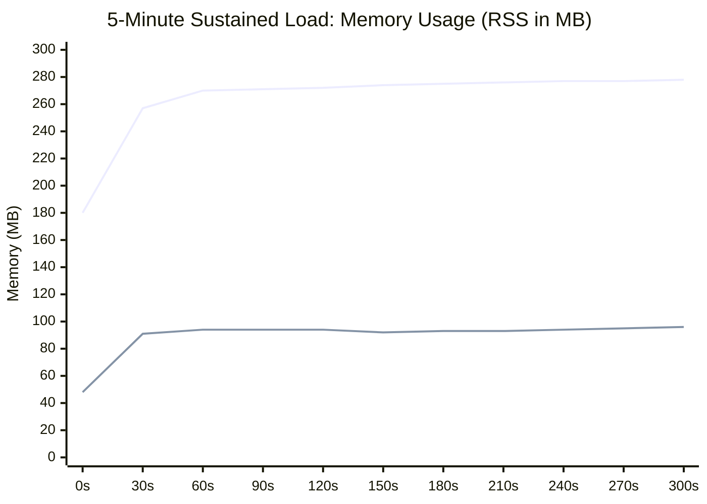
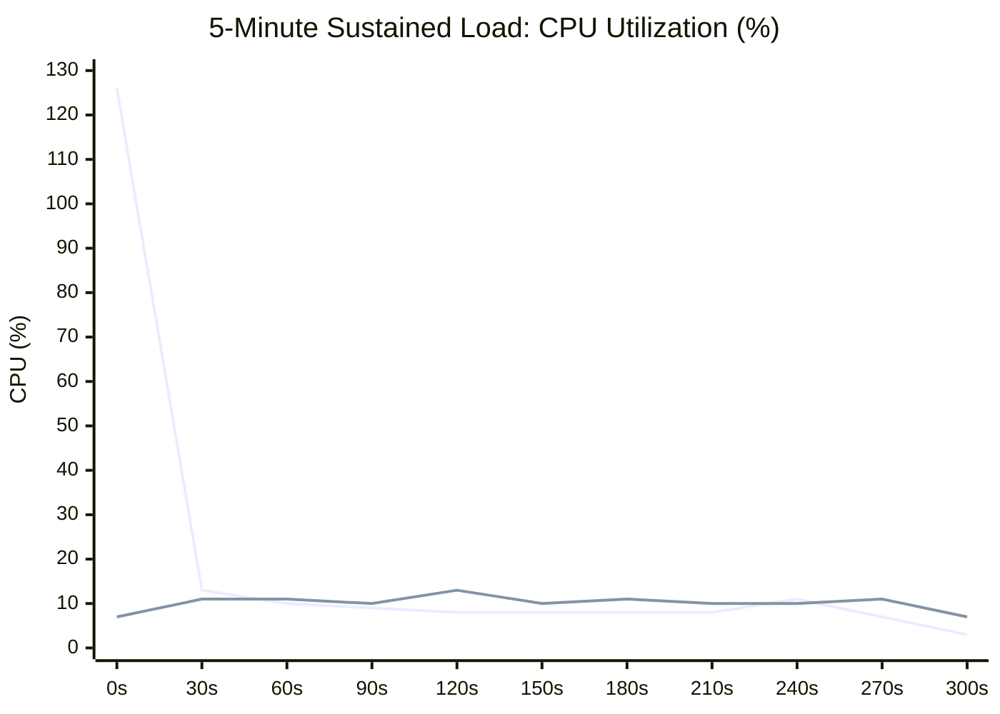

# Performance & Benchmarking (`SIPp`)

Performance benchmarks were executed using [**SIPp v3.7**](https://github.com/SIPp/sipp) comparing the standard **JVM (OpenJDK Zulu 25)** against the **GraalVM Native Executable** under identical hardware and network conditions.

### Test Scenarios

Benchmarks evaluated startup time, memory footprint (resident set size - RSS), and call processing under the standard SIPp UAC call setup and teardown scenario (`INVITE -> 180 Ringing -> 200 OK -> ACK -> BYE -> 200 OK`):

- **5-Minute Sustained Load**: 15,000 calls @ 50 calls/second continuously sampled over 300 seconds (5s intervals)
- **High Throughput Burst**: 1,000 calls @ 200 calls/second with individual response-time tracking (`-trace_rtt`)

### Comparison Table: JVM vs GraalVM Native

| Metric | JVM (Zulu JDK 25) | GraalVM Native Image | Delta / Improvement |
| :--- | :--- | :--- | :--- |
| **Startup Time** | `453 ms` | `13 ms` | **~35x faster** ⚡ |
| **Initial Idle Memory (RSS)** | `~190 MB` | `~47 MB` | **75% reduction** 📉 |
| **5-Min Memory (RSS) Graph** | `269 MB avg` / `278 MB peak`<br>`▅▇▇▇▇▇▇▇▇▇▇▇` *(180 → 278 MB)* | `92 MB avg` / `96 MB peak`<br>`▂▃▃▃▃▃▃▃▃▃▃▃` *(48 → 96 MB)* | **66% lower memory** 📉 |
| **5-Min CPU Usage Graph** | `13.0% avg` / `126% peak (JIT)`<br>`█▄          ` *(avg 13%, peak 126%)* | `10.5% avg` / `15% peak`<br>` ▄▆▅▅▅▆▆▅▆▅ ` *(avg 10.5%, peak 15%)* | **Zero JIT spikes, 20% lower CPU** ⚡ |
| **Peak Memory Under Load (1k calls)** | `~315 MB` | `~93 MB` | **70% reduction** 📉 |
| **Binary / Artifact Size** | `14 MB` *(requires ~400MB JRE)* | `53 MB` *(standalone executable)* | **Self-contained (no JRE required)** |
| **Throughput (15k calls / 5 min)** | `49.95 cps` (100% success) | `49.92 cps` (100% success) | **15,000 / 15,000 calls (0 loss)** |
| **Throughput (1k burst @ 200 cps)** | `188.32 cps` (100% success) | `197.67 cps` (100% success) | **1,000 / 1,000 calls (0 loss)** |
| **Failed Calls / Retransmissions** | `0` (0.0%) | `0` (0.0%) | **Zero packet loss** |
| **Mean Call Latency** | `51.97 ms` | `51.90 ms` | **Sub-millisecond variance** |
| **Latency P50 / P95 / P99** | `52ms / 55ms / 56ms` | `52ms / 54ms / 57ms` | **Low jitter & variance** |

> [!NOTE]
> Approximately `50 ms` of the measured call latency corresponds to the simulated pickup delay in [`CallController`](../sip-app/src/main/java/net/pilgrim/controller/CallController.java); net stack processing overhead is < `2 ms`.

### Packet Loss Resilience Benchmarks (Netem / SIPp `-lost`)

To verify the stack's RFC 3261 transaction and dialog timer recovery in adverse network environments, benchmarks were executed with synthetic UDP packet drops at **10% to 30% loss rates** alongside the zero-loss happy path:

| Benchmark Metric | Clean Network (0% Loss) | Moderate Loss (20% Loss) | Heavy Loss (30% Loss) |
| :--- | :---: | :---: | :---: |
| **Calls Attempted** | 500 | 200 | 200 |
| **Successful Calls** | **500 (100.0%)** | **200 (100.0%)** | **200 (100.0%)** |
| **Failed Calls** | **0 (0.0%)** | **0 (0.0%)** | **0 (0.0%)** |
| **Total Dropped Packets** | `0` | `322` | `444` |
| ↳ *Dropped INVITEs* | `0` | `50` | `68` |
| ↳ *Dropped 180 Ringing* | `0` | `46` | `52` |
| ↳ *Dropped 200 OK (INVITE)* | `0` | `60` | `97` |
| ↳ *Dropped ACKs* | `0` | `51` | `69` |
| ↳ *Dropped BYEs* | `0` | `56` | `80` |
| ↳ *Dropped 200 OK (BYE)* | `0` | `59` | `78` |
| **Retransmissions Handled** | `0` | **154** (56 INVITE, 98 BYE) | **194** (77 INVITE, 117 BYE) |
| **Effective Target Rate** | 50 cps | 20 cps | 20 cps |
| **Measured Rate** | 48.5 cps | 19.8 cps | 19.7 cps |
| **Timer Recovery Roles** | Happy path | Timers A, B, D, G, J active | Timers A, B, D, G, J active |

> [!TIP]
> **Why Calls Succeeded with 100% Reliability Under 30% Loss**:
> - **Timer A (Client Retransmission)**: Re-sent initial and lost `INVITE`s at $T_1 \to 2T_1$ intervals until the server acknowledged.
> - **Timer G (Server 2xx Retransmission)**: Held the unacknowledged transaction and re-sent `200 OK` until the client's `ACK` arrived over the lossy link.
> - **Timer D (Client ACK Retention)**: Kept client transaction filters active to absorb duplicate/late 3xx–6xx responses and resend ACKs without confusing the application state.
> - **Timer J (Server Non-INVITE Caching)**: Replayed cached `200 OK` for duplicate `BYE` requests without throwing dialog-not-found exceptions.

### 5-Minute Sustained Load Charts

#### Memory Footprint (RSS in MB) over 5 Minutes


#### CPU Utilization (%) over 5 Minutes


### Running SIPp Benchmarks

```bash
# 1. Start application:
# Option A: GraalVM Native Executable
./sip-app/build/native/nativeCompile/sip-app

# Option B: JVM (Zulu JDK 25)
java -jar sip-app/build/libs/sip-app-0.1.3-all.jar
# or via Gradle:
./gradlew :sip-app:run

# 2. Run clean baseline load test (500 calls at 50 cps)
sipp 127.0.0.1:5060 -sn uac -p 5080 -m 500 -r 50 -d 0 -trace_screen -trace_stat

# 3. Run high-throughput burst load test (1,000 calls at 200 cps)
sipp 127.0.0.1:5060 -sn uac -p 5080 -m 1000 -r 200 -d 0 -trace_screen -trace_stat

# 4. Run 5-minute sustained SIPp load test (15,000 calls at 50 cps)
sipp 127.0.0.1:5060 -sn uac -p 5080 -m 15000 -r 50 -d 0 -trace_screen -trace_stat
```
