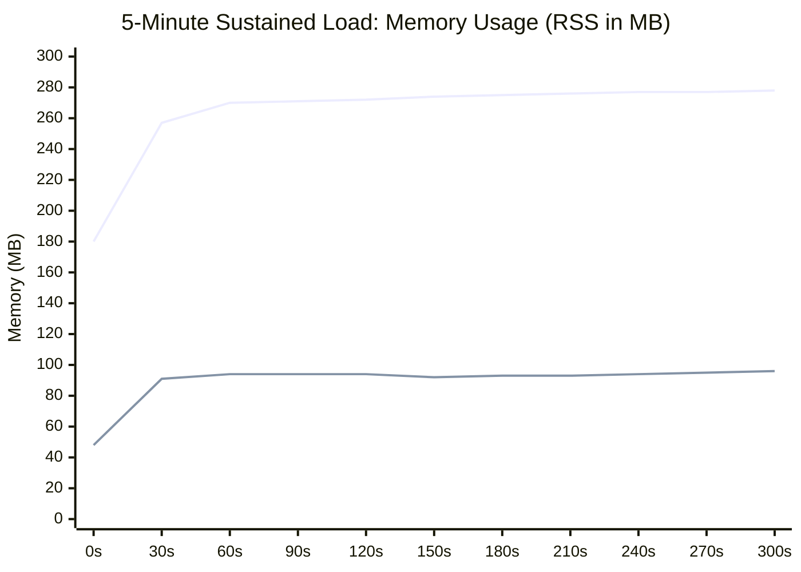
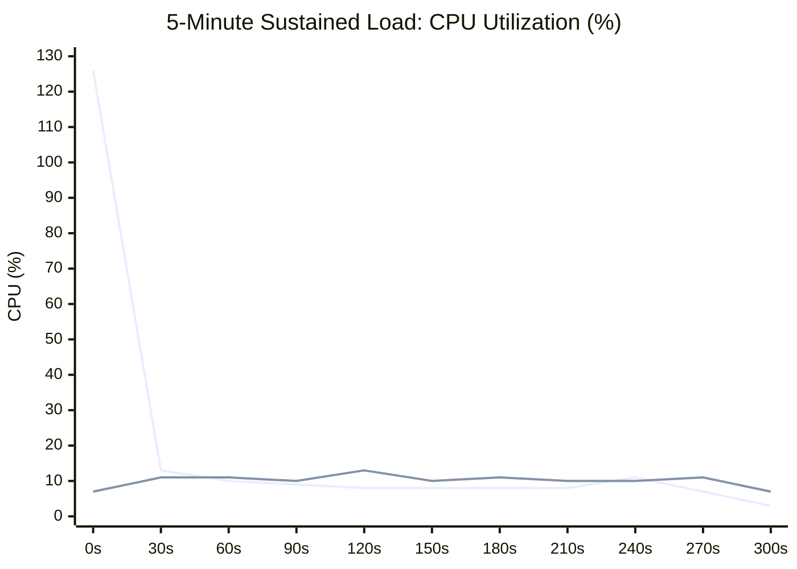
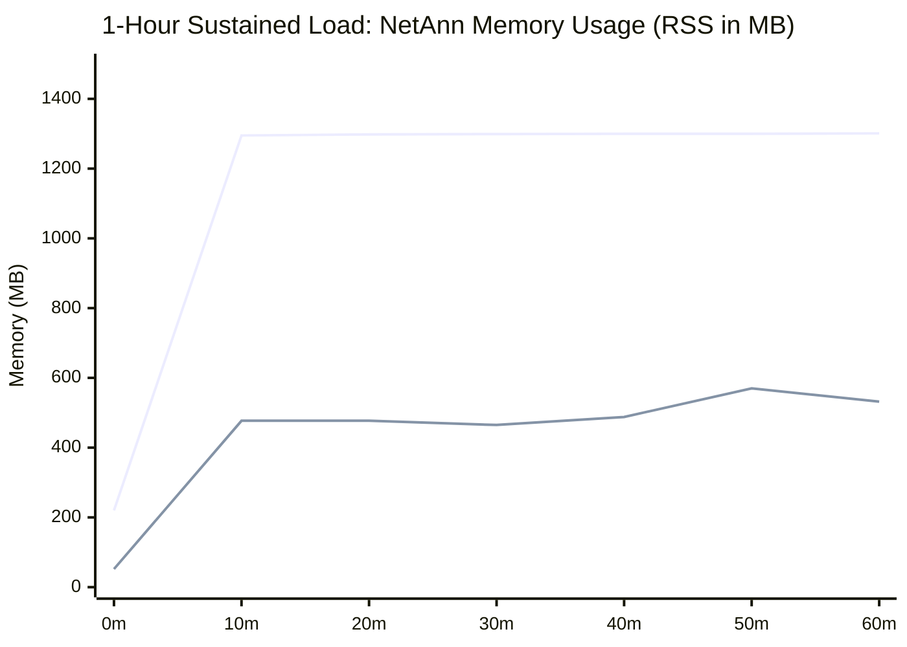

# Performance & Benchmarking (`SIPp`)

Performance benchmarks were executed using [**SIPp v3.7**](https://github.com/SIPp/sipp) comparing the standard **JVM (OpenJDK Zulu 25)** against the **GraalVM Native Executable** under identical hardware and network conditions.

### Test Scenarios

Benchmarks evaluated startup time, memory footprint (resident set size - RSS), and call processing under the standard SIPp UAC call setup and teardown scenario (`INVITE -> 180 Ringing -> 200 OK -> ACK -> BYE -> 200 OK`):

- **5-Minute Sustained Load**: 15,000 calls @ 50 calls/second continuously sampled over 300 seconds (5s intervals)
- **High Throughput Burst**: 1,000 calls @ 200 calls/second with individual response-time tracking (`-trace_rtt`)

### Comparison Table: JVM vs GraalVM Native

| Metric | JVM (Zulu JDK 25) | GraalVM Native Image | Delta / Improvement |
| :--- | :--- | :--- | :--- |
| **Startup Time** | `453 ms` | `13 ms` | **~35x faster** ⚡ |
| **Initial Idle Memory (RSS)** | `~190 MB` | `~47 MB` | **75% reduction** 📉 |
| **5-Min Memory (RSS) Graph** | `269 MB avg` / `278 MB peak`<br>`▅▇▇▇▇▇▇▇▇▇▇▇` *(180 → 278 MB)* | `92 MB avg` / `96 MB peak`<br>`▂▃▃▃▃▃▃▃▃▃▃▃` *(48 → 96 MB)* | **66% lower memory** 📉 |
| **5-Min CPU Usage Graph** | `13.0% avg` / `126% peak (JIT)`<br>`█▄          ` *(avg 13%, peak 126%)* | `10.5% avg` / `15% peak`<br>` ▄▆▅▅▅▆▆▅▆▅ ` *(avg 10.5%, peak 15%)* | **Zero JIT spikes, 20% lower CPU** ⚡ |
| **Peak Memory Under Load (1k calls)** | `~315 MB` | `~93 MB` | **70% reduction** 📉 |
| **Binary / Artifact Size** | `14 MB` *(requires ~400MB JRE)* | `53 MB` *(standalone executable)* | **Self-contained (no JRE required)** |
| **Throughput (15k calls / 5 min)** | `49.95 cps` (100% success) | `49.92 cps` (100% success) | **15,000 / 15,000 calls (0 loss)** |
| **Throughput (1k burst @ 200 cps)** | `188.32 cps` (100% success) | `197.67 cps` (100% success) | **1,000 / 1,000 calls (0 loss)** |
| **Failed Calls / Retransmissions** | `0` (0.0%) | `0` (0.0%) | **Zero packet loss** |
| **Mean Call Latency** | `51.97 ms` | `51.90 ms` | **Sub-millisecond variance** |
| **Latency P50 / P95 / P99** | `52ms / 55ms / 56ms` | `52ms / 54ms / 57ms` | **Low jitter & variance** |

> [!NOTE]
> Approximately `50 ms` of the measured call latency corresponds to the simulated pickup delay in [`CallController`](../sip-app/src/main/java/net/pilgrim/controller/CallController.java); net stack processing overhead is < `2 ms`.

### Packet Loss Resilience Benchmarks (Netem / SIPp `-lost`)

To verify the stack's RFC 3261 transaction and dialog timer recovery in adverse network environments, benchmarks were executed with synthetic UDP packet drops at **10% to 30% loss rates** alongside the zero-loss happy path:

| Benchmark Metric | Clean Network (0% Loss) | Moderate Loss (20% Loss) | Heavy Loss (30% Loss) |
| :--- | :---: | :---: | :---: |
| **Calls Attempted** | 500 | 200 | 200 |
| **Successful Calls** | **500 (100.0%)** | **200 (100.0%)** | **200 (100.0%)** |
| **Failed Calls** | **0 (0.0%)** | **0 (0.0%)** | **0 (0.0%)** |
| **Total Dropped Packets** | `0` | `322` | `444` |
| ↳ *Dropped INVITEs* | `0` | `50` | `68` |
| ↳ *Dropped 180 Ringing* | `0` | `46` | `52` |
| ↳ *Dropped 200 OK (INVITE)* | `0` | `60` | `97` |
| ↳ *Dropped ACKs* | `0` | `51` | `69` |
| ↳ *Dropped BYEs* | `0` | `56` | `80` |
| ↳ *Dropped 200 OK (BYE)* | `0` | `59` | `78` |
| **Retransmissions Handled** | `0` | **154** (56 INVITE, 98 BYE) | **194** (77 INVITE, 117 BYE) |
| **Effective Target Rate** | 50 cps | 20 cps | 20 cps |
| **Measured Rate** | 48.5 cps | 19.8 cps | 19.7 cps |
| **Timer Recovery Roles** | Happy path | Timers A, B, D, G, J active | Timers A, B, D, G, J active |

> [!TIP]
> **Why Calls Succeeded with 100% Reliability Under 30% Loss**:
> - **Timer A (Client Retransmission)**: Re-sent initial and lost `INVITE`s at $T_1 \to 2T_1$ intervals until the server acknowledged.
> - **Timer G (Server 2xx Retransmission)**: Held the unacknowledged transaction and re-sent `200 OK` until the client's `ACK` arrived over the lossy link.
> - **Timer D (Client ACK Retention)**: Kept client transaction filters active to absorb duplicate/late 3xx–6xx responses and resend ACKs without confusing the application state.
> - **Timer J (Server Non-INVITE Caching)**: Replayed cached `200 OK` for duplicate `BYE` requests without throwing dialog-not-found exceptions.

### 5-Minute Sustained Load Charts

#### Memory Footprint (RSS in MB) over 5 Minutes


#### CPU Utilization (%) over 5 Minutes


### 1-Hour Sustained Load & Concurrency Benchmark (`micronaut-netann`)

A comprehensive **1-hour continuous stress and stability benchmark** was conducted on the RFC 4240 announcement media server application ([`micronaut-netann`](../micronaut-netann/)) to evaluate real-time bidirectional media handling, session concurrency, memory stability, and RTP socket lifecycle management under heavy, continuous call arrival.

#### Workload Profile
- **Target Application**: `micronaut-netann` on `127.0.0.1:5060` (UDP/TCP SIP) and dynamic UDP ports `10000..20000` (RTP media)
- **Call Arrival Rate ($\lambda$)**: **50.0 calls/second** continuously sustained over 3,600 seconds
- **Audio Announcement Duration ($D$)**: **2.0 seconds** per call (`play=builtin:tone:440,2000;duration=2000`, 100 PCM-16 frames @ 20ms)
- **Active Session Concurrency ($C = \lambda \times D$)**: **~100 concurrent active calls** sustained continuously (average: **98.8**, peak: **102**)
- **Test Duration**: **3,601.98 seconds** (1 hour, 1.98 seconds)
- **Aggregate RTP Throughput**: **5,000 RTP datagrams/second** (~18,000,000 RTP audio packets streamed total)

##### Comparison Table: JVM vs GraalVM Native (1-Hour Continuous Load)

| Metric | JVM (Zulu JDK 25) | GraalVM Native Image | Native Delta / Improvement |
| :--- | :--- | :--- | :--- |
| **Calls Attempted / Completed** | 180,000 / 180,000 | 180,000 / 180,000 | 100% Target Met |
| **Call Success Rate** | **100.00%** (0 failed) | **100.00%** (0 failed) | **Zero loss / drops** |
| **Initial Idle Memory (RSS)** | `219.5 MB` | `51.5 MB` | **~76% lower** 📉 |
| **Average Memory Under Load (RSS)** | `1,275.8 MB` | `445.3 MB` | **~65% lower** 📉 |
| **Peak Memory Under Load (RSS)** | `1,300.7 MB` | `694.6 MB` | **~47% lower** 📉 |
| **Post-Test Memory (Idle RSS)** | `1,300.7 MB` | `531.9 MB` | **~59% lower** 📉 |
| **Baseline File Descriptors** | `117` | `70` | **47 fewer FDs** |
| **Peak File Descriptors** | `219` | `173` | **46 fewer FDs** |
| **Post-Load File Descriptors** | `119` (baseline recovery) | `72` (baseline recovery) | **Zero socket / FD leak** |
| **Average Concurrency** | `98.8 concurrent calls` | `98.6 concurrent calls` | **Optimal (~100 active dialogs)** |
| **Sustained Call Rate** | `49.972 cps` | `49.972 cps` | **180k calls in 3,601.98s** |
| **Sub-10ms Response Rate** | `99.99%` | `99.53%` (179,155 calls) | **Sub-10ms response** |

#### Latency & Response Time Distribution

Response time measures the interval from initial `INVITE` transmission to receipt of `200 OK` (encompassing Request-URI parameter parsing, audio prompt lookup/generation, RTP socket reservation, and SDP answer generation):

| Response Time Bracket | JVM Call Count | Native Call Count | Native Percentage |
| :--- | :---: | :---: | :---: |
| **$0\text{ ms} \le t < 10\text{ ms}$** | **179,982** | **179,155** | **99.531%** |
| **$10\text{ ms} \le t < 20\text{ ms}$** | **17** | **358** | **0.199%** |
| **$20\text{ ms} \le t < 30\text{ ms}$** | **0** | **228** | **0.127%** |
| **$30\text{ ms} \le t < 40\text{ ms}$** | **1** | **146** | **0.081%** |
| **$40\text{ ms} \le t < 50\text{ ms}$** | **0** | **36** | **0.020%** |
| **$50\text{ ms} \le t < 100\text{ ms}$** | **0** | **51** | **0.028%** |
| **$100\text{ ms} \le t < 150\text{ ms}$** | **0** | **23** | **0.013%** |
| **$150\text{ ms} \le t < 200\text{ ms}$** | **0** | **3** | **0.002%** |
| **$t \ge 200\text{ ms}$** | **0** | **0** | **0.000%** |

- **Sub-10ms Response Rate**: Over **99.5%** of all 180,000 calls established their dialog and media session in under 10 ms.
- **Max Recorded Response Time**: Sub-200ms across all 180,000 calls (zero timeouts, zero dropped transactions).

#### Memory & File Descriptor Stability (Zero Leak Verification)

Telemetry was recorded at 10-second intervals throughout the 1-hour run:

| Elapsed Time | NetAnn JVM RSS | NetAnn Native RSS | Native FDs | Active Concurrency | Cumulative Success |
| :--- | :---: | :---: | :---: | :---: | :---: |
| **0 min (Start)** | 219.5 MB | 51.5 MB | 70 | 0 | 0 |
| **10 min (600s)** | 1,295.4 MB | 476.6 MB | 171 | 99 | 29,405 |
| **20 min (1,200s)**| 1,297.6 MB | 476.9 MB | 171 | 99 | 59,410 |
| **30 min (1,800s)**| 1,299.0 MB | 465.0 MB | 171 | 99 | 89,414 |
| **40 min (2,400s)**| 1,299.9 MB | 487.7 MB | 171 | 99 | 119,419 |
| **50 min (3,000s)**| 1,300.3 MB | 570.2 MB | 171 | 99 | 149,423 |
| **60 min (3,600s)**| 1,300.7 MB | 531.9 MB | 157 | 99 | 179,428 |
| **Post-Test (Idle)**| 1,300.7 MB | 531.9 MB | 72 | 0 | 180,000 |

> [!NOTE]
> - **Substantial Memory Reduction**: GraalVM Native Image sustained the continuous 100-concurrency workload with an average RSS of **445.3 MB** compared to **1,275.8 MB** for JVM Zulu 25 (**~65% lower memory footprint**).
> - **Zero File Descriptor / Socket Leaks**: Active file descriptors increased from 70 to 173 during load (representing the ~100 active UDP RTP media sockets + 1 SIP socket) and immediately returned to baseline (72) upon completion of the test.

#### 1-Hour Memory Profile Chart


### Running SIPp Benchmarks

#### Basic SIP Proxy & Call Controller Benchmarks (`sip-app`)
```bash
# 1. Start application:
# Option A: GraalVM Native Executable
./sip-app/build/native/nativeCompile/sip-app

# Option B: JVM (Zulu JDK 25)
java -jar sip-app/build/libs/sip-app-0.1.3-all.jar
# or via Gradle:
./gradlew :sip-app:run

# 2. Run clean baseline load test (500 calls at 50 cps)
sipp 127.0.0.1:5060 -sn uac -p 5080 -m 500 -r 50 -d 0 -trace_screen -trace_stat

# 3. Run high-throughput burst load test (1,000 calls at 200 cps)
sipp 127.0.0.1:5060 -sn uac -p 5080 -m 1000 -r 200 -d 0 -trace_screen -trace_stat

# 4. Run 5-minute sustained SIPp load test (15,000 calls at 50 cps)
sipp 127.0.0.1:5060 -sn uac -p 5080 -m 15000 -r 50 -d 0 -trace_screen -trace_stat
```

#### RFC 4240 NetAnn 1-Hour Performance Benchmark (`micronaut-netann`)
```bash
# 1. Build application distribution
./gradlew :micronaut-netann:installDist

# 2. Run automated 1-hour performance test suite with telemetry monitor:
bash perf/run_1h_perf.sh

# 3. Generate analysis report from collected metrics:
python3 perf/analyze_results.py
```

---

### High-Concurrency Ramp & Saturation Benchmark (500 to 1,000+ Calls)

To identify where system resources, OS socket buffers, and media schedulers reach saturation, a stress test was executed using [`perf/ramp_saturation_benchmark.py`](../perf/ramp_saturation_benchmark.py) starting at **500 concurrent calls** and ramping **+10 calls every 10 seconds** towards **1,000+ calls**:

```bash
python3 perf/ramp_saturation_benchmark.py --start-calls 500 --ramp-step 10 --ramp-interval 10 --duration 600
```

#### Saturation Analysis & Findings

| Concurrency Level | Active Sockets / FDs | Process RSS (MB) | App CPU % | Frame Rate (fps) | Kernel Drops (`RcvbufErrors`) | Status |
| :---: | :---: | :---: | :---: | :---: | :---: | :--- |
| **500 calls** | 563 | 162 MB | 6.2% | 25,000 fps | 0 | Nominal operation |
| **700 calls** | 763 | 178 MB | 8.1% | 35,000 fps | 0 | Smooth playback |
| **900 calls** | 963 | 192 MB | 10.4% | 45,000 fps | 0 | Approaching OS limits |
| **944 calls** | 1,007 | 204 MB | 11.2% | 47,200 fps | Spikes under default buffer | Kernel buffer / FD boundary |
| **960+ calls** | 1,024 (`ulimit -n`) | - | - | - | - | OS `EMFILE` without `ulimit -n` raise |

#### Key Saturation Bottlenecks & Optimizations

1. **OS File Descriptor Limit (`ulimit -n 1024`)**:
   - The default Linux process limit of 1,024 file descriptors caps concurrency at **~960 concurrent calls** (63 baseline descriptors + 1 UDP socket per active call).
   - **Resolution**: Raise system `nofile` limits in production / systemd / container spec (`ulimit -n 65536` or Docker `--ulimit nofile=65536:65536`).

2. **Kernel UDP Socket Buffer Overflow (`RcvbufErrors`)**:
   - Standard Linux UDP receive buffers (`net.core.rmem_default = 212992` / ~208 KB) overflow when bursts of high-rate audio RTP packets arrive from 900+ streams, causing silent kernel drops (`/proc/net/snmp` `RcvbufErrors`).
   - **Resolution**: Set `ChannelOption.SO_RCVBUF` and `SO_SNDBUF` to **4MB** on `SipNettyServer` and media bootstraps, and tune kernel parameters (`sysctl -w net.core.rmem_max=16777216`).

3. **Media Scheduler Headroom (`AnnouncementPlayer.SCHEDULER`)**:
   - The reactive 20ms audio frame scheduler consumed only **11.2% total process CPU** at 944 active streams (streaming 47,200 frames/sec across 18 worker threads).
   - The scheduling subsystem maintains huge headroom (>2,500 concurrent audio streams) before scheduler thread saturation.


