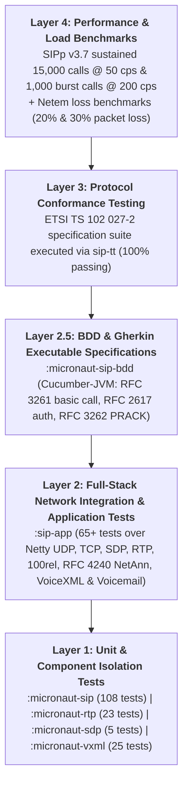
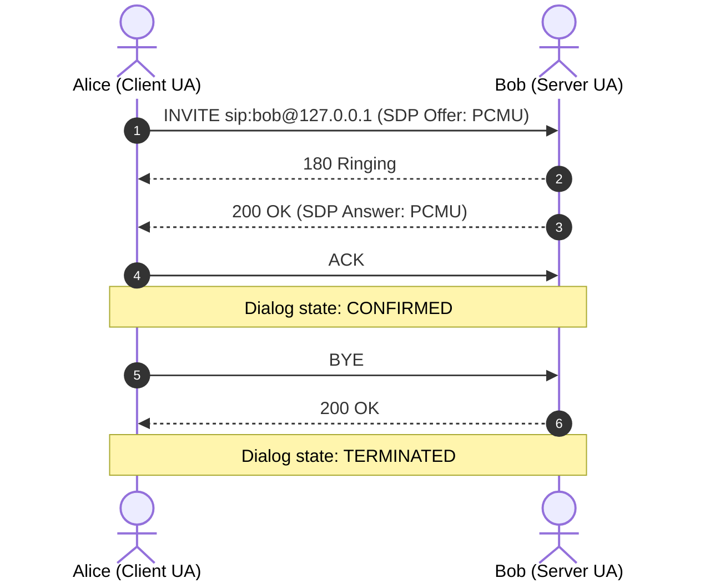

# Testing

## Automated Test Suites & Quality Assurance Architecture

The codebase enforces a rigorous, multi-tiered testing and verification pyramid guaranteeing RFC compliance, DoS resilience, thread safety, and zero-regression reliability. The test pyramid comprises **automated JVM unit and integration tests** across all Gradle modules, high-level **BDD Gherkin executable specifications (`:micronaut-sip-bdd`)**, external **ETSI TS 102 027-2 conformance verification**, and high-throughput **SIPp benchmarks**:



### Test Suites Summary

| Module | Test Suite Class | Tests | Primary Focus & Target Specifications |
| :--- | :--- | :---: | :--- |
| `:micronaut-sip` | [`SipParserTest`](../micronaut-sip/src/test/java/net/pilgrim/sip/SipParserTest.java) | 5 | RFC 3261 §7 & §19 message syntax, header unfolding, compact alias mappings, URI parsing |
| `:micronaut-sip` | [`SipEncoderTest`](../micronaut-sip/src/test/java/net/pilgrim/sip/SipEncoderTest.java) | 2 | Wire-level serialization, RFC 3261 §8.2.6 response construction, Via ordering, To-tag generation |
| `:micronaut-sip` | [`SipParserFuzzTest`](../micronaut-sip/src/test/java/net/pilgrim/sip/SipParserFuzzTest.java) | 7 | RFC 3261 §21.5.2 DoS bounds enforcement (`513 Message Too Large`), random payload fuzzing |
| `:micronaut-sip` | [`SipFilterTest`](../micronaut-sip/src/test/java/net/pilgrim/sip/SipFilterTest.java) | 6 | Reactive interceptor pipeline SPI, `@SipFilter` ordering, request/response mutation, short-circuiting |
| `:micronaut-sip` | [`SipRateLimitTest`](../micronaut-sip/src/test/java/net/pilgrim/sip/SipRateLimitTest.java) | 7 | Token-bucket rate limiter, RFC 3261 §21.5.4 `503 Service Unavailable`, `Retry-After`, silent ACK drop |
| `:micronaut-sip` | [`SipMdcFilterTest`](../micronaut-sip/src/test/java/net/pilgrim/sip/SipMdcFilterTest.java) | 1 | SLF4J MDC context population with Call-ID, CSeq, method, and deterministic reactive cleanup |
| `:micronaut-sip` | [`SipMetricsTest`](../micronaut-sip/src/test/java/net/pilgrim/sip/SipMetricsTest.java) | 4 | Micrometer counters, request duration timers, session gauges, rejection tracking |
| `:micronaut-sip` | [`SipCancelTest`](../micronaut-sip/src/test/java/net/pilgrim/sip/SipCancelTest.java) | 3 | RFC 3261 §9.2 / §17.2.3 CANCEL transaction matching, 200 OK to CANCEL + 487 emission, 481 handling |
| `:micronaut-sip` | [`SipErrorAndTryingTest`](../micronaut-sip/src/test/java/net/pilgrim/sip/SipErrorAndTryingTest.java) | 3 | `@SipError` inheritance hierarchy matching, non-blocking 200ms `100 Trying` timer |
| `:micronaut-sip` | [`ViaHeaderTest`](../micronaut-sip/src/test/java/net/pilgrim/sip/ViaHeaderTest.java) | 8 | RFC 3581 `rport`, RFC 3261 §18.2.1 `received` IP spoofing mitigation, response destination resolution |
| `:micronaut-sip` | [`SipSessionManagerTest`](../micronaut-sip/src/test/java/net/pilgrim/sip/SipSessionManagerTest.java) | 4 | Stateful dialog transitions, touch timestamps, TTL expiration, bounded LRU cap eviction |
| `:micronaut-sip` | [`SipRouteBindingTest`](../micronaut-sip/src/test/java/net/pilgrim/sip/SipRouteBindingTest.java) | 2 | Controller parameter binding annotations (`@SipCallId`, `@SipFrom`, `@SipParam`, etc.) |
| `:micronaut-sip` | [`SipServerHealthIndicatorTest`](../micronaut-sip/src/test/java/net/pilgrim/sip/SipServerHealthIndicatorTest.java) | 2 | Micronaut Management `/health` endpoint integration for UDP/TCP server and session metrics |
| `:micronaut-sip` | [`SipTimerTest`](../micronaut-sip/src/test/java/net/pilgrim/sip/SipTimerTest.java) | 28 | RFC 3261 timers: Timer A & E retransmissions, Timer B & F, Timer D ACK resend, Timer G & H UAS 2xx, Timer J replay, auto 100 Trying, TTL, virtual time, race conditions |
| `:micronaut-sip` | [`SipExtendedMethodsTest`](../micronaut-sip/src/test/java/net/pilgrim/sip/SipExtendedMethodsTest.java) | 7 | RFC 3262 / RFC 6665 / RFC 3515 / RFC 3311 / RFC 3903 dispatching (`@OnPrack`, `@OnSubscribe`, `@OnNotify`, `@OnRefer`, `@OnUpdate`, `@OnPublish`) |
| `:micronaut-sip` | [`SipRouteDtmfBindingTest`](../micronaut-sip/src/test/java/net/pilgrim/sip/SipRouteDtmfBindingTest.java) | 4 | Controller parameter binding for `@SipDtmf` (`DtmfSignal`, `char`, `String`) and required validation |
| `:micronaut-sip` | [`DtmfSignalTest`](../micronaut-sip/src/test/java/net/pilgrim/sip/dtmf/DtmfSignalTest.java) | 10 | RFC 4733 / RFC 6086 DTMF tone normalization, bounds, body generation and parsing (`application/dtmf-relay`, `application/dtmf`) |
| `:micronaut-sip` | [`SipMessageDtmfTest`](../micronaut-sip/src/test/java/net/pilgrim/sip/model/SipMessageDtmfTest.java) | 5 | SIP message DTMF payload attachment, extraction, and content-type convenience helpers |
| `:micronaut-sdp` | [`SdpNegotiatorTest`](../micronaut-sdp/src/test/java/net/pilgrim/sdp/SdpNegotiatorTest.java) | 4 | RFC 4566 / RFC 3264 SDP parsing, offer generation, direction negotiation (hold), and codec filtering |
| `:micronaut-rtp` | [`MediaPortManagerTest`](../micronaut-rtp/src/test/java/net/pilgrim/sip/rtp/media/MediaPortManagerTest.java) | 2 | RFC 3550 §11 even RTP / companion odd RTCP dynamic port allocation and pool exhaustion handling |
| `:micronaut-rtp` | [`RtpNettyStreamingTest`](../micronaut-rtp/src/test/java/net/pilgrim/sip/rtp/transport/RtpNettyStreamingTest.java) | 2 | Asynchronous Netty UDP pipeline packetization, framing, and reactive inbound packet streaming |
| `:micronaut-rtp` | [`G711CodecTest`](../micronaut-rtp/src/test/java/net/pilgrim/sip/rtp/G711CodecTest.java) | 4 | RFC 3551 G.711 PCMU (payload type 0) & PCMA (payload type 8) audio transcoding and clipping fidelity |
| `:micronaut-rtp` | [`AudioFrameTest`](../micronaut-rtp/src/test/java/net/pilgrim/sip/rtp/media/AudioFrameTest.java) | 3 | 16-bit linear PCM audio frame encapsulation, little-endian short conversions, and RMS / dBFS energy calculation |
| `:micronaut-rtp` | [`RtpStreamingTest`](../micronaut-rtp/src/test/java/net/pilgrim/sip/rtp/RtpStreamingTest.java) | 3 | RFC 3550 packet serialization, header flag parsing, and offline sender/receiver streaming |
| `:micronaut-rtp` | [`RtpMediaManagerTest`](../micronaut-rtp/src/test/java/net/pilgrim/sip/rtp/media/RtpMediaManagerTest.java) | 3 | Concurrent media session allocation, dedicated Netty event loop group isolation, and lifecycle teardown |
| `:micronaut-rtp` | [`RtpAudioHookTest`](../micronaut-rtp/src/test/java/net/pilgrim/sip/rtp/media/RtpAudioHookTest.java) | 6 | Inbound/outbound audio processing hooks, Goertzel dual-tone multifrequency detector, voice activity detection, and reactive PCM frame streaming |
| `:sip-app` | [`SipIntegrationTest`](../sip-app/src/test/java/net/pilgrim/sip/SipIntegrationTest.java) | 26 | Live UDP network call flows, RFC 3960 early-media in-band ringback, RFC 3262 100rel PRACK flow, mid-dialog INFO DTMF relay, late/early-offer SDP, dynamic RTP probe, netem packet drop resilience |
| `:sip-app` | [`SipTcpIntegrationTest`](../sip-app/src/test/java/net/pilgrim/sip/SipTcpIntegrationTest.java) | 10 | End-to-end TCP streaming call flows, RFC 3262 PRACK over TCP, TCP DTMF relay, framing reassembly, RFC 5626 keep-alive, TCP SDP/RTP integration |
| `:sip-app` | [`AnnouncementIntegrationTest`](../sip-app/src/test/java/net/pilgrim/netann/AnnouncementIntegrationTest.java) | 9 | RFC 4240 NetAnn announcement service (`annc`), `play`/`repeat`/`delay`/`duration` parameters, 20ms RTP audio streaming, auto-`BYE`, error semantics (`400`, `404`, `488`), and TCP transport |
| `:sip-app` | [`AnnouncementSecurityAndNetworkingTest`](../sip-app/src/test/java/net/pilgrim/netann/AnnouncementSecurityAndNetworkingTest.java) | 8 | SSRF prevention (blocking private/loopback/metadata IPs), 10MB memory size caps, `repeat=forever` duration ceiling, per-IP concurrency throttling (`503`), and Contact port verification |
| `:sip-app` | [`MailboxIntegrationTest`](../sip-app/src/test/java/net/pilgrim/mailbox/MailboxIntegrationTest.java) | 4 | Answering machine call flows (`mailbox`, `<owner>+mailbox`), VoiceXML execution, DTMF `#` completion, and object storage persistence |
| `:sip-app` | [`MailboxRecordingServiceTest`](../sip-app/src/test/java/net/pilgrim/mailbox/MailboxRecordingServiceTest.java) | 4 | Voicemail recording persistence in Object Storage, key conventions, and caller extraction |
| `:micronaut-sip-bdd` | [`RunCucumberTest`](../micronaut-sip-bdd/src/test/java/net/pilgrim/sip/bdd/RunCucumberTest.java) | 5 Scenarios (70 steps) | Executable RFC 3261/3262/3960/2617 Gherkin specifications: basic audio call, early media session progress, digest authentication challenge, reliable provisional PRACK handshake, and call rejection |

---

### Detailed Breakdown: `:micronaut-sip` Unit & Component Suites (108 Tests)

#### 1. [`SipParserTest`](../micronaut-sip/src/test/java/net/pilgrim/sip/SipParserTest.java) (5 Tests)
- **`testParseStandardInvite`**: Verifies zero-copy string parsing of an RFC 3261 standard `INVITE` datagram, verifying Request-URI, method, SIP version, headers (`Via`, `From`, `To`, `Call-ID`, `CSeq`, `Contact`, `Content-Type`, `Content-Length`), and SDP body payload extraction.
- **`testParseResponse`**: Tests response parsing including SIP status code (`200`), reason phrase (`OK`), and preservation of multiple header values.
- **`testHeaderUnfolding`**: Enforces RFC 3261 §7.3.1 header line unfolding: multi-line header fields separated by CRLF followed by spaces or tabs (`\r\n\s` or `\r\n\t`) are seamlessly concatenated into a single logical header value.
- **`testCompactHeaders`**: Validates bidirectional compact header alias translation according to RFC 3261 Table 1 (`v` -> `Via`, `f` -> `From`, `t` -> `To`, `i` -> `Call-ID`, `m` -> `Contact`, `c` -> `Content-Type`, `l` -> `Content-Length`, `s` -> `Subject`, `k` -> `Supported`, etc.).
- **`testSipUriParsing`**: Tests full parsing of `sip:` and `sips:` URIs into userinfo, password, host, port (IPv4 and bracketed IPv6), URI parameters (`transport=udp`, `lr`), and embedded query headers.

#### 2. [`SipEncoderTest`](../micronaut-sip/src/test/java/net/pilgrim/sip/SipEncoderTest.java) (2 Tests)
- **`testEncodeAndDecodeRequest`**: Asserts round-trip lossless encoding and decoding of SIP requests with bodies, verifying exact `Content-Length` synchronization and CRLF line terminations.
- **`testCreateResponseRfc3261Compliance`**: Validates strict RFC 3261 §8.2.6 compliance during response generation via `SipRequest.createResponse(...)`:
  - Preserves incoming `Via` header stack in exact order (including branch tokens and transport designations).
  - Copies `From` and `Call-ID` unchanged.
  - Matches `CSeq` sequence number and method.
  - Generates a cryptographically random hexadecimal `To` tag (§8.2.6.2) for provisional/final responses while strictly omitting tags for `100 Trying`.

#### 3. [`SipParserFuzzTest`](../micronaut-sip/src/test/java/net/pilgrim/sip/SipParserFuzzTest.java) (7 Tests)
- **`testMalformedInputsFailGracefully`**: Verifies that truncated, malformed, or garbage byte sequences return `null` or parse errors rather than throwing unchecked JVM runtime exceptions.
- **`testMessageTooLargeEnforcement`**: Validates RFC 3261 §21.5.2 DoS bounds: incoming packets exceeding `sip.server.max-message-size-bytes` (default 64 KB) are rejected with `513 Message Too Large`.
- **`testMaxHeaderCountEnforcement`**: Verifies rejection when incoming packets contain more than `sip.server.max-header-count` (default 100 headers), preventing algorithmic complexity attacks.
- **`testMaxHeaderSizeEnforcement`**: Validates rejection of oversized individual header lines exceeding `sip.server.max-header-size-bytes` (default 8 KB).
- **`testRandomFuzzingNeverCrashesWithUnexpectedExceptions`**: Executes 200 random byte-array permutations through the parser to ensure complete panic-freedom and memory safety.
- **`testValidRequestWithBodyAndFoldedHeaders`**: Confirms that complex valid packets combining folded headers, compact aliases, and payload bodies parse cleanly.
- **`testValidResponseParsing`**: Confirms standard response parsing across 1xx, 2xx, 4xx, and 5xx status codes.

#### 4. [`SipFilterTest`](../micronaut-sip/src/test/java/net/pilgrim/sip/SipFilterTest.java) (6 Tests)
- **`testFilterExecutionOrder`**: Verifies that multiple registered `SipServerFilter` beans are executed strictly in order based on `Ordered.getOrder()` and `@SipFilter(order = ...)`.
- **`testRequestMutationInFilter`**: Validates that upstream filters can inspect and mutate request headers (e.g., adding `X-Correlation-Id`) prior to controller dispatch.
- **`testResponseMutationInFilter`**: Validates that filters can intercept and mutate downstream responses reactively (e.g., injecting security headers).
- **`testShortCircuitingFilter`**: Confirms that a filter can short-circuit the execution chain (e.g., returning `403 Forbidden` on missing credentials) without invoking subsequent filters or controller methods.
- **`testMethodSpecificFilterWithAnnotation`**: Tests `@SipFilter(methods = {SipMethod.INVITE})` targeting: the filter only intercepts `INVITE` requests and transparently bypasses `REGISTER` or `OPTIONS`.
- **`testFilterMultiResponseStreaming`**: Verifies that filters correctly handle reactive `Publisher<SipResponse>` streams emitting multiple provisional and final responses (such as `180 Ringing` followed by `200 OK`).

#### 5. [`SipRateLimitTest`](../micronaut-sip/src/test/java/net/pilgrim/sip/SipRateLimitTest.java) (7 Tests)
- **`testRequestsAllowedWithinBurst`**: Verifies that requests arriving within the configured token-bucket burst limit (`sip.server.rate-limit.burst-capacity`) pass through unimpeded.
- **`testRejectionWhenBurstExceeded`**: Enforces RFC 3261 §21.5.4 overload protection: once tokens are depleted, subsequent requests are rejected with `503 Service Unavailable` accompanied by a `Retry-After: <seconds>` header.
- **`testAckDroppedSilentlyWhenRateLimited`**: Enforces RFC 3261 §17.2.1 compliance: rate-limited `ACK` requests are dropped silently with `Mono.empty()` without generating an error response, preventing UDP storm loops.
- **`testExactIpWhitelistBypassesRateLimit`**: Confirms that exact IP addresses specified in `sip.server.rate-limit.whitelist` (e.g. `127.0.0.1`, `::1`) bypass rate limiting completely.
- **`testCidrSubnetWhitelistBypassesRateLimit`**: Confirms that CIDR subnet blocks (e.g. `10.0.0.0/8`, `192.168.0.0/16`) are correctly parsed by `IpMatcher` and exempted from rate limits.
- **`testIpMatcherDirect`**: Unit tests IPv4 and IPv6 subnet matching logic across boundary conditions.
- **`testIpRateLimiterEviction`**: Verifies bounded cache memory protection: tracks that idle IP entries are purged when cache size exceeds `sip.server.rate-limit.max-tracked-ips` (default 10,000).

#### 6. [`SipMdcFilterTest`](../micronaut-sip/src/test/java/net/pilgrim/sip/SipMdcFilterTest.java) (1 Test)
- **`testMdcPopulatedInsideHandlerAndClearedAfterwards`**: Verifies that `SipMdcFilter` populates SLF4J MDC context with `sip.callId`, `sip.cseq`, `sip.method`, `sip.from`, and `sip.to` during controller execution, and deterministically cleans up all keys upon completion via reactive `doFinally()`.

#### 7. [`SipMetricsTest`](../micronaut-sip/src/test/java/net/pilgrim/sip/SipMetricsTest.java) (4 Tests)
- **`testDirectMetricsRecording`**: Validates direct Micrometer counter increments and timer latency sampling.
- **`testGaugesForSessionsAndTransport`**: Verifies dynamic gauge reporting for active dialog session count and transport channel readiness.
- **`testDispatcherInstrumentsRequestsAndResponses`**: Verifies that `SipDispatcher` automatically instruments incoming requests (`sip.server.requests` tagged by method and transport) and outgoing responses (`sip.server.responses` tagged by method, status code, status family, and transport).
- **`testDispatcherInstrumentsRejections`**: Verifies counter tracking for rejected requests (`sip.server.rejected` tagged by reason, such as `bad_request`, `method_not_allowed`, `bad_extension`).

#### 8. [`SipCancelTest`](../micronaut-sip/src/test/java/net/pilgrim/sip/SipCancelTest.java) (3 Tests)
- **`testCancelMatchingPendingInviteEmits200And487`**: Enforces RFC 3261 §9.2 and §17.2.3: an incoming `CANCEL` matching an in-flight `INVITE` transaction emits `200 OK` to the CANCEL, aborts the pending reactive `INVITE` pipeline, and emits `487 Request Terminated` to the caller.
- **`testCancelNonExistentTransactionReturns481`**: Verifies RFC 3261 §9.2: sending a `CANCEL` with an unknown `branch` or `Call-ID` immediately yields `481 Call/Transaction Does Not Exist`.
- **`testCancelAfterFinalResponseReturns481`**: Verifies that a `CANCEL` received after a final response (`200 OK`) has already been dispatched returns `481 Call/Transaction Does Not Exist`.

#### 9. [`SipErrorAndTryingTest`](../micronaut-sip/src/test/java/net/pilgrim/sip/SipErrorAndTryingTest.java) (3 Tests)
- **`testSipErrorHierarchyMatching`**: Verifies declarative `@SipError` exception mapping, confirming that specific subclass handlers take precedence over general parent exception handlers.
- **`testAuto100TryingEmittedWhenProcessingExceedsThreshold`**: Verifies RFC 3261 §17.2.1: when controller processing takes longer than `sip.server.trying-delay-ms` (default 200 ms), a non-blocking reactive timer automatically emits `100 Trying` to suppress client UDP retransmissions.
- **`testAuto100TryingNotEmittedWhenResponseIsFast`**: Confirms that if controller processing finishes before the threshold, `100 Trying` is suppressed to conserve network bandwidth.

#### 10. [`ViaHeaderTest`](../micronaut-sip/src/test/java/net/pilgrim/sip/ViaHeaderTest.java) (8 Tests)
- **`testParseStandardVia`**: Parses standard IPv4 UDP Via header with branch token.
- **`testParseIpv6Via`**: Parses bracketed IPv6 Via header (`[::1]:5060`).
- **`testParseHostWithoutPort`**: Verifies fallback to default SIP port 5060 when no explicit port is declared.
- **`testRportFlagAndValue`**: Verifies RFC 3581 parsing for empty `rport` flag and populated `rport=port` values.
- **`testResolveResponseAddress`**: Validates response routing destination precedence: `rport` + `received` overrides `sent-by`.
- **`testProcessNatViaHostMismatch`**: Confirms that when `sent-by` host does not match physical packet source address, `received` parameter is automatically inserted.
- **`testProcessNatViaRportPopulated`**: Confirms that when client requests symmetric routing with empty `rport`, server populates `rport=<source-port>`.
- **`testProcessNatViaSpoofingMitigation`**: Validates spoofed IP mitigation: prevents malicious clients from redirecting responses by overriding `sent-by`.

#### 11. [`SipSessionManagerTest`](../micronaut-sip/src/test/java/net/pilgrim/sip/SipSessionManagerTest.java) (4 Tests)
- **`testSessionCreationAndTouch`**: Validates session initialization and `touch()` updating last-accessed timestamp.
- **`testSessionExpirationWithTtl`**: Validates automated expiration and removal of inactive sessions exceeding `sip.server.session-ttl-ms`.
- **`testMaxSessionCapacityAndEviction`**: Enforces bounded LRU eviction: when session count reaches `sip.server.max-sessions`, least-recently used sessions are evicted to prevent memory exhaustion.
- **`testEvictTerminatedSessions`**: Verifies immediate cleanup of sessions transitioned to `State.TERMINATED`.

#### 12. [`SipRouteBindingTest`](../micronaut-sip/src/test/java/net/pilgrim/sip/SipRouteBindingTest.java) (2 Tests)
- **`testParameterBindingAnnotations`**: Validates compile-time parameter binding and runtime injection for `@SipCallId`, `@SipFrom`, `@SipTo`, `@SipBody`, `@SipHeader`, `@SipParam`, and active `SipSession`.
- **`testRequiredParamMissingThrowsException`**: Asserts that requests missing a required `@SipParam(required = true)` fail fast with a descriptive binding exception.

#### 13. [`SipServerHealthIndicatorTest`](../micronaut-sip/src/test/java/net/pilgrim/sip/SipServerHealthIndicatorTest.java) (2 Tests)
- **`testHealthIndicatorWhenServerIsStopped`**: Confirms health status reports `HealthStatus.DOWN` when the SIP server is stopped.
- **`testHealthIndicatorWhenServerIsRunning`**: Confirms health status reports `HealthStatus.UP` with operational details (bound UDP port, bound TCP port, and active dialog count) when running.

#### 14. [`SipTimerTest`](../micronaut-sip/src/test/java/net/pilgrim/sip/SipTimerTest.java) (28 Tests)
- **`testAuto100TryingEmittedWhenProcessingExceedsDelay`**: Enforces RFC 3261 §17.2.1: when controller processing exceeds the configured timer threshold (e.g. 80ms), a non-blocking reactive timer automatically emits `100 Trying` to quell UDP retransmissions before `200 OK`.
- **`testAuto100TryingNotEmittedWhenFastResponse`**: Asserts that fast responses suppress the `100 Trying` timer and emit only the final response.
- **`testAuto100TryingCancelledWhenProvisional180RingingEmittedEarly`**: Asserts that when a controller emits a provisional response (such as `180 Ringing`) before the timer fires, the auto `100 Trying` timer is immediately cancelled and never emitted.
- **`testAuto100TryingCancelledWhenCancelArrivesBeforeTimerFires`**: Asserts that if a `CANCEL` arrives while an `INVITE` is pending, the timer is aborted; the transaction emits `200 OK` (to CANCEL) and `487 Request Terminated` (to INVITE), and `100 Trying` is never emitted.
- **`testAuto100TryingCancelledWhenControllerFailsImmediately`**: Asserts that synchronous controller errors cancel the timer and emit the mapped error response without emitting `100 Trying`.
- **`testAuto100TryingCancelledWhenReactiveControllerFailsAsync`**: Asserts that asynchronous reactive pipeline errors (`Mono.error()`) cancel the timer cleanly.
- **`testAuto100TryingDisabledWhenConfiguredFalse`**: Verifies that when `sip.server.auto-100-trying-enabled=false`, slow requests never emit `100 Trying`.
- **`testClientUdpRequestTimeoutThrowsTimeoutException`**: Verifies that `ReactiveSipClient.send(...)` times out non-blockingly and emits `TimeoutException` when sending to an unresponsive UDP endpoint.
- **`testClientUdpRequestTimeoutUnregistersResponseRouterListeners`**: Enforces zero listener leaks: asserts that upon client timeout, all registered transaction listeners in `SipResponseRouter` are cleaned up.
- **`testClientPerRequestCustomTimeoutOverride`**: Validates per-request timeout overrides via `ReactiveSipClient.send(req, dest, Duration.ofMillis(100))` overriding the server configuration default.
- **`testClientSendWithProvisionalTimeoutThrowsTimeoutException`**: Asserts that `sendWithProvisional` enforces reactive timeout limits.
- **`testTokenBucketReplenishmentOverTime`**: Validates high-resolution time replenishment: exhausts tokens, sleeps for elapsed refill duration, and asserts tokens replenish according to configured rate per second.
- **`testTokenBucketCapsAtCapacityAfterLongIdle`**: Asserts that idle token replenishment never overflows beyond the configured burst capacity.
- **`testSessionTouchResetsExpirationTimer`**: Asserts that invoking `session.touch()` resets the expiration window and extends dialog session lifetime past the original TTL deadline.
- **`testEvictExpiredSessionsBatchTimer`**: Validates batch eviction of expired sessions while preserving active touched sessions.
- **`testTimerBCancelledOn1xxProvisionalResponse`**: Validates Timer B cancellation: asserts that receiving a provisional response (`180 Ringing`) immediately cancels Timer B ($64 \times T_1$), allowing the call to ring past the initial timeout and succeed when `200 OK` arrives without cutoff.
- **`testRingTimeoutExpiresWhenRingingNeverAnswers`**: Asserts that if provisional `180 Ringing` arrives but the call is never answered, the alerting `ringTimeoutMs` timer fires and terminates the stream with `TimeoutException`.
- **`testTimerAClientInviteRetransmissionOnUdp`**: Enforces RFC 3261 §17.1.1.2: asserts that `ReactiveSipClient` exponentially retransmits `INVITE` requests over UDP ($T_1, 2T_1\dots$) until a provisional or final response is received, stopping retransmissions immediately.
- **`testTimerEClientNonInviteRetransmissionOnUdp`**: Enforces RFC 3261 §17.1.2.2: asserts that `ReactiveSipClient` retransmits non-INVITE requests (`OPTIONS`, `REGISTER`) over UDP doubling up to $T_2$ until answered.
- **`testTimerDClientAbsorbs3xxTo6xxRetransmissionsAndResendsAck`**: Enforces RFC 3261 §17.1.1.2: asserts that receiving a 3xx–6xx final error response (`486 Busy Here`) auto-sends `ACK`, completes the subscriber sink, and absorbs subsequent duplicate error responses while re-sending `ACK` during Timer D ($T_4$).
- **`testTimerGUasRetransmits200OkUntilAck`**: Enforces RFC 3261 §13.3.1.4: asserts that the UAS dialog layer retransmits `200 OK` responses to `INVITE` over UDP at $T_1 \to 2T_1 \dots \le T_2$ until an incoming `ACK` is received, which cancels Timer G retransmissions.
- **`testTimerHUasTeardownOnAckTimeout`**: Enforces RFC 3261 §13.3.1.4: asserts that if no `ACK` arrives before Timer H expires ($64 \times T_1 = 32\text{ s}$), the UAS dialog terminates the session (`TERMINATED`), emits outbound `BYE`, and records timeout failure metrics.
- **`testTimerJServerNonInviteResponseCacheAndReplay`**: Enforces RFC 3261 §17.2.2: asserts that the server non-INVITE transaction cache keyed by `branch:method` replays the cached `200 OK` response for retransmitted requests without re-executing controller routes, automatically evicting entries upon Timer J expiry.
- **`testLateAckAfterTimerHDoesNotResurrectSession`**: Verifies that when Timer H terminates an unacknowledged session and sends an outbound `BYE`, an incoming late `ACK` arrives into a dead dialog, is discarded cleanly, and does not resurrect or leak the terminated session.
- **`testAckVsTimerGRaceCondition`**: High-concurrency stress test simultaneously firing Timer G retransmissions and incoming `ACK` packets across 40 parallel threads to verify thread-safe `AtomicBoolean` race resolution, zero memory leaks, and idempotent disposable cleanup.
- **`testVirtualTimeTimerGAndHPrecision`**: Executes deterministic virtual-time stepping via `VirtualTimeScheduler` without wall-clock sleeps, verifying Timer G exponential backoff ($500\text{ ms} \to 1000\text{ ms} \to 2000\text{ ms}$) and exact Timer H $32\text{ s}$ termination with outbound `BYE`.
- **`testSecondInviteDuringProceedingRejectedWith500AndRetryAfter`**: Enforces RFC 3261 §14.2: when a second `INVITE` arrives on the same dialog while the initial transaction is still in `Proceeding` state, the server rejects it with `500 Server Internal Error` containing a randomized `Retry-After: 1..10` header.
- **`testDuplicateInviteRetransmitsProvisionalResponse`**: Enforces RFC 3261 §17.2.1: retransmitted `INVITE` requests arriving while the server transaction is in `Proceeding` state immediately re-send the cached provisional response (`180 Ringing`) without invoking controller logic twice.

#### 15. [`SipExtendedMethodsTest`](../micronaut-sip/src/test/java/net/pilgrim/sip/SipExtendedMethodsTest.java) (7 Tests)
- **`testPrackDispatch`**: Verifies RFC 3262 provisional acknowledgement dispatching to `@OnPrack` controller handlers.
- **`testSubscribeDispatch`**: Verifies RFC 6665 event subscription dispatching to `@OnSubscribe` controller handlers.
- **`testNotifyDispatch`**: Verifies RFC 6665 event notification dispatching to `@OnNotify` controller handlers.
- **`testReferDispatch`**: Verifies RFC 3515 call transfer dispatching to `@OnRefer` controller handlers.
- **`testUpdateDispatch`**: Verifies RFC 3311 session modification dispatching to `@OnUpdate` controller handlers.
- **`testPublishDispatchWithPathMatching`**: Verifies RFC 3903 publication dispatching to `@OnPublish` controller handlers with path-based URI pattern filtering.
- **`testAllowedMethodsIncludesAllExtendedMethods`**: Verifies that the server's synthesized `Allow` header dynamically advertises all registered extended methods (`PRACK`, `SUBSCRIBE`, `NOTIFY`, `REFER`, `UPDATE`, `PUBLISH`).

#### 16. [`SipRouteDtmfBindingTest`](../micronaut-sip/src/test/java/net/pilgrim/sip/SipRouteDtmfBindingTest.java) (4 Tests)
- **`testDtmfSignalBinding`**: Validates declarative `@SipDtmf DtmfSignal` parameter injection from inbound DTMF relay payloads.
- **`testCharAndStringDtmfBinding`**: Validates automatic primitive conversion of DTMF tones to `char` and `String` method parameters.
- **`testUnannotatedDtmfSignalBinding`**: Confirms that method arguments of type `DtmfSignal` without explicit `@SipDtmf` annotation are resolved and injected cleanly.
- **`testRequiredDtmfThrowsWhenMissing`**: Asserts that requests lacking DTMF payloads fail with a descriptive binding exception when `@SipDtmf(required = true)`.

#### 17. [`DtmfSignalTest`](../micronaut-sip/src/test/java/net/pilgrim/sip/dtmf/DtmfSignalTest.java) (10 Tests)
- **`testValidDigitsAndNormalization`**: Validates standard telephone keypad digits (`0`-`9`, `*`, `#`, `A`-`D`) and upper-case normalization.
- **`testInvalidDigitsThrowException`**: Confirms that non-telephony characters throw `IllegalArgumentException`.
- **`testDurationAndVolumeDefaults`**: Validates default duration (160ms) and volume attenuation (-10 dBm0) compliance.
- **`testToRelayBody`**: Validates serialization into RFC 4733 / RFC 6086 `application/dtmf-relay` text formatting (`Signal=...`, `Duration=...`).
- **`testToDtmfBody`**: Validates serialization into `application/dtmf` compact format.
- **`testParseApplicationDtmfRelay`**: Validates robust parsing of RFC 6086 relay payloads with key-value pairs.
- **`testParseApplicationDtmf`**: Validates parsing of RFC 4733 plain numeric tone indicators.
- **`testParseTextPlainAndLooseFormats`**: Verifies parsing of loose plain-text DTMF representation.
- **`testNonDtmfContentReturnsEmpty`**: Asserts that unrecognized content types or empty payloads return `Optional.empty()` safely.
- **`testEqualsAndHashCode`**: Validates value object equality and hash contract.

#### 18. [`SipMessageDtmfTest`](../micronaut-sip/src/test/java/net/pilgrim/sip/model/SipMessageDtmfTest.java) (5 Tests)
- **`testRequestWithDtmfRelay`**: Confirms that `SipRequest.getDtmfSignal()` extracts DTMF from `application/dtmf-relay` requests.
- **`testRequestWithDtmfPlain`**: Confirms extraction from `application/dtmf` bodies.
- **`testRequestConvenienceDtmfBuilders`**: Tests fluent builder API for constructing DTMF requests with appropriate `Content-Type`.
- **`testNonDtmfRequest`**: Asserts that non-DTMF requests (e.g., SDP offers) return `Optional.empty()`.
- **`testSetDtmfOnResponse`**: Validates attaching DTMF confirmation attributes to outbound SIP responses.

---

### Detailed Breakdown: `:micronaut-sdp` Unit Suites (4 Tests)

#### 1. [`SdpNegotiatorTest`](../micronaut-sdp/src/test/java/net/pilgrim/sdp/SdpNegotiatorTest.java) (4 Tests)
- **`generatesDefaultAudioOffer`**: Verifies generation of compliant RFC 4566 SDP offer strings with session identifiers, connection information (`c=IN IP4 0.0.0.0`), audio media descriptor (`m=audio <port> RTP/AVP 0 8`), and codec attribute mappings (`a=rtpmap:0 PCMU/8000`, `a=rtpmap:8 PCMA/8000`, `a=sendrecv`).
- **`createsMatchingAnswerForOffer`**: Validates RFC 3264 offer/answer exchange: matches offered payload types against local supported codecs and binds the answer to a dynamically allocated local RTP audio port.
- **`handlesHoldDirection`**: Validates directional call hold semantics: an incoming offer with `a=sendonly` is answered with `a=recvonly`, while `a=inactive` is preserved.
- **`filtersUnsupportedCodecs`**: Confirms that unsupported or unknown codec payload types in incoming offers are filtered out of the negotiated SDP answer.

---

### Detailed Breakdown: `:micronaut-rtp` Streaming Suites (23 Tests)

#### 1. [`MediaPortManagerTest`](../micronaut-rtp/src/test/java/net/pilgrim/sip/rtp/media/MediaPortManagerTest.java) (2 Tests)
- **`allocatesEvenPortsAndTracksState`**: Validates RFC 3550 §11 port allocation: dynamically assigns even UDP ports ($P$) for RTP and implicitly reserves the paired odd port ($P+1$) for RTCP within the configured range (default 10000–20000).
- **`exhaustionThrowsException`**: Asserts that requesting additional ports when the pool capacity is saturated fails fast with `IllegalStateException` without leaking bitset indices.

#### 2. [`RtpNettyStreamingTest`](../micronaut-rtp/src/test/java/net/pilgrim/sip/rtp/transport/RtpNettyStreamingTest.java) (2 Tests)
- **`streamsRtpPacketOverNettyPipeline`**: Verifies asynchronous Netty pipeline serialization and transmission of G.711 $\mu$-law frames over `NioDatagramChannel` with sequence number and timestamp tracking.
- **`receivesInboundPacketWithSenderMetadataReactively`**: Validates reactive packet intake via `RtpInboundPacket`, capturing source socket address metadata alongside decoded RTP payloads.

#### 3. [`G711CodecTest`](../micronaut-rtp/src/test/java/net/pilgrim/sip/rtp/G711CodecTest.java) (4 Tests)
- **`encodesAndDecodesUlaw`**: Verifies lossless / high-fidelity roundtrip transcoding between 16-bit linear PCM and ITU-T G.711 $\mu$-law (`PCMU`).
- **`encodesAndDecodesAlaw`**: Verifies roundtrip transcoding between 16-bit linear PCM and ITU-T G.711 A-law (`PCMA`).
- **`clippingBoundariesUlaw`**: Tests amplitude clamping and saturation handling at positive and negative 16-bit PCM extrema for $\mu$-law.
- **`clippingBoundariesAlaw`**: Tests amplitude clamping and saturation handling at extrema for A-law.

#### 4. [`AudioFrameTest`](../micronaut-rtp/src/test/java/net/pilgrim/sip/rtp/media/AudioFrameTest.java) (3 Tests)
- **`testAudioFrameProperties`**: Validates frame instantiation, sample rate, duration calculation, and payload byte array access.
- **`testToShortArrayLittleEndianConversion`**: Verifies signed 16-bit little-endian byte-to-short audio sample unpacking.
- **`testRmsAndDbfsOnSilenceAndTone`**: Validates audio signal energy computation, testing Root Mean Square (RMS) and decibels relative to full scale (dBFS) for digital silence versus sinusoidal full-scale signals.

#### 5. [`RtpStreamingTest`](../micronaut-rtp/src/test/java/net/pilgrim/sip/rtp/RtpStreamingTest.java) (3 Tests)
- **`serializesAndParsesRtpPacket`**: Tests RFC 3550 wire-level byte serialization and zero-copy packet header extraction (version, padding, extension, CSRC count, marker bit, payload type, sequence number, timestamp, SSRC).
- **`packetizerIncrementsSequenceAndTimestamp`**: Verifies that `RtpPacketizer` monotonically increments sequence numbers and scales sample timestamps per 20ms packet duration (160 samples @ 8000 Hz).
- **`blockingSocketSenderReceiverIntegration`**: Validates loopback UDP streaming using standard blocking I/O primitives (`RtpStreamSender` and `RtpStreamReceiver`).

#### 6. [`RtpMediaManagerTest`](../micronaut-rtp/src/test/java/net/pilgrim/sip/rtp/media/RtpMediaManagerTest.java) (3 Tests)
- **`createsAndTerminatesSession`**: Verifies lifecycle binding of `RtpMediaSession` by SIP `Call-ID`, verifying port allocation and channel closure on `terminateSession()`.
- **`supportsConcurrentSessions`**: Verifies concurrent session allocation across independent threads without port collisions.
- **`cleanShutdownClosesChannels`**: Confirms that graceful shutdown of `RtpMediaManager` closes all active Netty datagram channels and terminates the dedicated media event loop group.

#### 7. [`RtpAudioHookTest`](../micronaut-rtp/src/test/java/net/pilgrim/sip/rtp/media/RtpAudioHookTest.java) (6 Tests)
- **`inboundAndOutboundProcessorsCaptureFrames`**: Validates interceptor pipeline hooking on incoming and outgoing RTP media audio frames.
- **`goertzelDetectorHookDetectsDtmfTone`**: Validates the embedded Goertzel discrete Fourier transform algorithm detecting telephone keypad dual-tone multi-frequencies from raw audio samples.
- **`voiceActivityDetectionHookDistinguishesSpeechFromSilence`**: Tests energy-based voice activity detection (VAD) differentiating speech activity from background noise or silence.
- **`mediaManagerSessionInitializerAppliesGlobalAudioProcessor`**: Confirms that global audio processors registered with `RtpMediaManager` are automatically applied to newly created media sessions.
- **`processorExceptionDoesNotDisruptSession`**: Asserts resilience: unchecked exceptions thrown by user-defined audio hooks are safely trapped and logged without terminating the RTP stream.
- **`incomingAudioFramesReactiveFluxEmitsDecodedPcm`**: Verifies reactive streaming of decoded 16-bit linear PCM `AudioFrame` instances through Project Reactor `Flux`.

---

### Detailed Breakdown: `:sip-app` Integration Suites (38 Tests)

#### 1. [`SipIntegrationTest`](../sip-app/src/test/java/net/pilgrim/sip/SipIntegrationTest.java) (25 Tests over UDP)
- **`testServerIsRunning`**: Asserts that the Netty NIO datagram channel successfully binds to port 5060 and the application context starts cleanly.
- **`testFullCallFlow`**: Executes complete RFC 3261 terminating dialog lifecycle over live UDP sockets:
  1. Client sends `INVITE` with SDP offer.
  2. Server responds with provisional `180 Ringing`.
  3. Server completes pickup after 50 ms delay and responds with `200 OK` containing unicast SDP answer.
  4. Client acknowledges with `ACK`.
  5. Client terminates call with `BYE`.
  6. Server acknowledges termination with `200 OK`.
- **`test100RelPrackFlowUdp`**: Enforces RFC 3262: executes reliable provisional response flow (`180 Ringing` with `Require: 100rel` and `RSeq`), acknowledges with client `PRACK` matching `RAck`, and completes call setup with `200 OK` and `ACK`.
- **`testRegisterFlow`**: Validates SIP user registration (`REGISTER`), verifying Contact header echoing and custom headers (`X-Registered-User`, `Expires: 3600`).
- **`testRegisterFlowWithExplicitUriParam`**: Tests request-URI parameter parsing over the network (`sip:registrar@127.0.0.1:5060;transport=udp`).
- **`testOptionsFlow`**: Validates RFC 3261 §11 capability discovery (`OPTIONS`), asserting that the server returns `200 OK` with `Allow: INVITE, ACK, BYE, CANCEL, OPTIONS, REGISTER, MESSAGE, INFO, PRACK, SUBSCRIBE, NOTIFY, REFER, UPDATE, PUBLISH`.
- **`testMessageFlow`**: Validates RFC 3428 instant messaging (`MESSAGE`), asserting `200 OK` delivery for text payloads.
- **`testDtmfOverSipInfoMidDialog`**: Validates mid-dialog RFC 2976 / RFC 6086 DTMF relay: client transmits `INFO` with `application/dtmf-relay` (`Signal=5`, `Duration=160`), server parses `@SipDtmf` parameter, appends tone to `SipSession` attributes, and confirms with `200 OK` (`X-Received-DTMF: 5`).
- **`testDtmfOverSipMessage`**: Validates standalone RFC 3428 instant messaging DTMF tone delivery: client sends `MESSAGE` with `application/dtmf-relay`, server resolves `@SipDtmf` and returns `200 OK`.
- **`testUnsupportedMethodReturnsMethodNotAllowed`**: Enforces RFC 3261 §8.2.1: sending an unmapped method (`FOOBAR`) yields `405 Method Not Allowed` with an `Allow` header listing registered routes.
- **`testMalformedRequestMissingMandatoryHeadersReturnsBadRequest`**: Enforces RFC 3261 §8.1.1: sending an `INVITE` missing `Call-ID` or `CSeq` yields `400 Bad Request`.
- **`testUnsupportedRequireReturnsBadExtension`**: Enforces RFC 3261 §8.2.2: sending a request with `Require: 100rel, unknown-ext-123` yields `420 Bad Extension` with `Unsupported: unknown-ext-123`.
- **`testCancelPendingInviteFlow`**: Validates end-to-end call setup cancellation over UDP: sending `CANCEL` while `INVITE` is pending yields `200 OK` to the CANCEL followed by `487 Request Terminated` to the INVITE.
- **`testCancelUnknownTransactionReturns481`**: Verifies that canceling an unknown or non-existent transaction over the network yields `481 Call/Transaction Does Not Exist`.
- **`testCustomFilterAppliedOverNetwork`**: Verifies that registered reactive `SipServerFilter` beans intercept live UDP packets, mutate headers (`X-Filtered-By`), and inject telemetry over the network.
- **`testNetworkAuto100TryingOverUdp`**: End-to-end network verification of RFC 3261 §17.2.1 auto 100 Trying timer: sends an `INVITE` to a delayed controller route (`sip:slow@127.0.0.1:5060`), verifying that the server emits `100 Trying` over live UDP datagrams after 200ms before returning `200 OK`.
- **`testNetworkClientTimeoutOverUdp`**: End-to-end network verification of client request timeout: asserts that sending a request to an unresponsive UDP port fires the client timeout timer and produces `TimeoutException` within the configured interval.
- **`testFirstInviteDroppedRetransmittedSucceeds`**: Simulates initial UDP datagram drop: client retransmits `INVITE` via Timer A, and server processes the retransmitted request and establishes session without degradation.
- **`testDropped200OkUasTimerGRetransmits`**: Simulates dropped `200 OK` or missing initial `ACK`: server Timer G table holds the unacknowledged transaction and retransmits `200 OK` until valid incoming `ACK` cancels the timer.
- **`testDroppedAckServerRetransmits200OkUntilAck`**: Simulates dropped `ACK` via packet filter: UAS Timer G continues retransmitting `200 OK` until the client's retransmitted second `ACK` arrives and cancels Timer G and H.
- **`testDuplicateByeServerReplays200Ok`**: Enforces RFC 3261 §17.2.2: simulates duplicate/retransmitted `BYE` datagrams over the network; server replays cached `200 OK` from Timer J cache without invoking controller logic twice.
- **`testRegisterRetransmittedMidProcessing`**: Tests in-flight idempotence: retransmitted `REGISTER` datagram arriving while registration transaction is being processed succeeds cleanly without race conditions.
- **`testLateOfferAnswerFlowOverUdp`**: Validates late-offer negotiation over UDP: `INVITE` without SDP is answered with offer in `200 OK`, and client returns SDP answer in `ACK`.
- **`testDynamicRtpPortAllocatedAndReleasedOnBye`**: Verifies that `CallController` allocates a dynamic Netty RTP port from `MediaPortManager` during call setup and deterministically releases it upon `BYE`.
- **`testAckTriggersRtpProbeOverUdp`**: Verifies that receiving an `ACK` on a confirmed dialog triggers an initial RTP media probe packet to the client's negotiated media address over UDP.

#### 2. [`SipTcpIntegrationTest`](../sip-app/src/test/java/net/pilgrim/sip/SipTcpIntegrationTest.java) (10 Tests over TCP)
- **`testTcpServerIsRunning`**: Verifies that Netty TCP server socket channel binds and accepts incoming TCP connections on port 5060.
- **`testFullCallFlowOverTcp`**: Executes the complete call signaling flow (`INVITE` -> `180 Ringing` -> `200 OK` -> `ACK` -> `BYE` -> `200 OK`) over a persistent, multiplexed TCP stream socket.
- **`test100RelPrackFlowTcp`**: Validates RFC 3262 reliable provisional response and PRACK exchange over a persistent, multiplexed TCP stream socket.
- **`testMessageOverTcp`**: Verifies instant messaging (`MESSAGE`) framing and transaction delivery over TCP.
- **`testDtmfOverTcp`**: Validates mid-dialog RFC 2976 / RFC 6086 DTMF tone relay signaling over TCP streaming connection.
- **`testRegisterOverTcp`**: Verifies registration transaction processing over TCP.
- **`testOptionsOverTcp`**: Verifies `OPTIONS` capability exchange over TCP.
- **`testTcpKeepAliveAndFraming`**: Tests RFC 5626 §4.4 keep-alive behavior: injects leading CRLF and double CRLF ping sequences before valid SIP frames; confirms `SipStreamFrameDecoder` discards keep-alive bytes without corrupting subsequent SIP message boundaries.
- **`testLateOfferAnswerFlowOverTcp`**: Validates RFC 3261 / RFC 3264 late-offer/answer flow over persistent TCP streaming connections.
- **`testAckTriggersRtpProbeWhenSignalingIsTcp`**: Confirms that RTP media sessions and probe packets are properly coordinated even when SIP signaling operates over TCP.

#### 3. [`SipAppTest`](../sip-app/src/test/java/net/pilgrim/SipAppTest.java) (3 Tests)
- **`testItWorks`**: Validates Micronaut dependency injection context initialization and verifies that `SipUdpServer` and `SipTcpServer` singleton beans are wired correctly.
- **`testExecutableMethodProcessorRegisteredRoutes`**: Asserts that `SipControllerProcessor` discovered and compiled all `@SipController` method routes into `SipRouteRegistry` at compile time without reflection.
- **`testDuplicateRouteDetectionThrowsException`**: Asserts that registering duplicate controller routes for the same SIP method throws a configuration exception during bootstrap to prevent ambiguous dispatching.

---

### Detailed Breakdown: `:sip-app` NetAnn & Mailbox Suites

#### 1. [`AnnouncementIntegrationTest`](../sip-app/src/test/java/net/pilgrim/netann/AnnouncementIntegrationTest.java) (9 Tests)
- **`testSuccessfulAnnouncementPlaybackAndRtpStreaming`**: Validates complete RFC 4240 NetAnn announcement lifecycle: sends `INVITE sip:annc@...;play=tone:440` with SDP offer, verifies `200 OK` with negotiated SDP answer, sends `ACK`, and confirms reception of live 20ms G.711 $\mu$-law RTP audio packets over UDP.
- **`testAnnouncementCompletionEmitsBye`**: Verifies RFC 4240 §2 termination: media server streams the entire configured audio prompt and automatically initiates call teardown by sending an in-dialog `BYE` request to the client upon playback completion.
- **`testMissingPlayParameterReturns400`**: Enforces RFC 4240 §2 mandatory parameter validation: an `INVITE` to `sip:annc@...` lacking the mandatory `play=` parameter is immediately rejected with `400 Bad Request` and reason `"Mandatory play parameter missing"`.
- **`testNonExistentAnnouncementReturns404`**: Enforces RFC 4240 error semantics: an announcement URI referencing a non-existent or unresolvable audio file yields `404 Not Found` with reason `"Announcement content not found"`.
- **`testUnsupportedServiceIndicatorReturns488`**: Enforces RFC 4240 §2: requests directed to unhandled service identifiers (such as `sip:conf@...` or unknown user parts) are rejected with `488 Not Acceptable Here`.
- **`testEarlyByeTerminatesPlayback`**: Verifies that when a caller hangs up prematurely by sending an in-dialog `BYE` before announcement completion, playback halts immediately, background RTP streamer threads are cancelled, and port resources are released cleanly.
- **`testBundledWavFilePlayback`**: Tests decoding and streaming of bundled WAV audio assets (`file:`, `classpath:prompts/welcome.wav`) decoded via `AudioSystem` into signed 16-bit linear PCM and packetized into 20ms RTP frames.
- **`testAnnouncementOverTcp`**: Validates end-to-end NetAnn announcement signaling and session establishment over persistent TCP transport while streaming audio over UDP RTP.
- **`testOptionsQuery`**: Verifies RFC 3261 §11 capability query on the NetAnn server, returning `200 OK` with supported methods and services.

---

### Executing Automated Tests

Execute all tests across all modules:
```bash
./gradlew check test
```

Execute only the SIP protocol unit test suite (`:micronaut-sip`):
```bash
./gradlew :micronaut-sip:test
```

Execute only the SDP negotiation test suite (`:micronaut-sdp`):
```bash
./gradlew :micronaut-sdp:test
```

Execute only the RTP media streaming test suite (`:micronaut-rtp`):
```bash
./gradlew :micronaut-rtp:test
```

Execute only the VoiceXML dialog engine test suite (`:micronaut-vxml`):
```bash
./gradlew :micronaut-vxml:test
```

Execute only the unified SIP application test suite (`:sip-app`):
```bash
./gradlew :sip-app:test
```

Execute a specific test class:
```bash
./gradlew :micronaut-sip:test --tests net.pilgrim.sip.SipRateLimitTest
./gradlew :sip-app:test --tests net.pilgrim.sip.SipIntegrationTest
./gradlew :sip-app:test --tests net.pilgrim.netann.AnnouncementIntegrationTest
./gradlew :sip-app:test --tests net.pilgrim.mailbox.MailboxIntegrationTest
```

View HTML test execution reports:
```bash
open micronaut-sip/build/reports/tests/test/index.html
open sip-app/build/reports/tests/test/index.html
```

---

## Conformance Testing (`sip-tt`)

The SIP application and stack are verified against **RFC 3261** and **RFC 3264** using [**OpenIPC/sip-tt**](https://github.com/OpenIPC/sip-tt), an open-source headless SIP conformance test tool scored against **ETSI TS 102 027-2**.

### Test Execution

To execute the terminating endpoint conformance suite against a running `sip-app` instance:

```bash
# 1. Start sip-app (listening on port 5060)
./gradlew :sip-app:run

# 2. Run sip-tt conformance tests (all mandatory and recommended purposes)
sip-tt run \
  --target 127.0.0.1:5060 \
  --local-ip 127.0.0.1 \
  --roles terminating \
  --id-glob 'SIP_CC_TE_*' \
  --id-glob 'LOCAL-SDP-ANSWER*' \
  --id-glob 'LOCAL-SDP-HOLD*' \
  --json-report results.json
```

### Conformance Test Results (8 of 8 Passed, 100% Conformance)

| Test Purpose | Specification | Status | Duration | Description |
| :--- | :--- | :---: | :---: | :--- |
| `SIP_CC_TE_CE_V_001` | RFC 3261 §8, §8.2, §13.3.1.1 | **PASSED** | 0.31s | Answers well-formed INVITE with provisional (1xx) and success (2xx) |
| `SIP_CC_TE_CE_V_006` | RFC 3261 §13.2.1, §13.3.1 | **PASSED** | 3.31s | Bodyless INVITE answered with offer in 2xx and accepts answer in ACK |
| `SIP_CC_TE_SM_I_001` | RFC 3261 §14.2 | **PASSED** | 0.01s | Second INVITE during `Proceeding` state refused with `500 Server Internal Error` and `Retry-After: 1..10` |
| `SIP_CC_TE_SM_V_001` | RFC 3261 §14 | **PASSED** | 0.62s | re-INVITE inside dialog is answered with its own CSeq (no cached replay) |
| `SIP_CC_TE_SM_V_002` | RFC 3261 §14 | **PASSED** | 0.62s | Bodyless re-INVITE accepted with 200 OK containing session offer |
| `SIP_CC_TE_SM_V_003` | RFC 3261 §13.3.1.4 | **PASSED** | 32.62s | UAS Timer H unacked 2xx retransmission ladder (32s) followed by outbound BYE dialog teardown |
| `LOCAL-SDP-ANSWER-KEEPS-OFFERED-PAYLOAD-NUMBERS` | RFC 3264 §6.1 | **PASSED** | 0.45s | SDP answer preserves offered payload type number bindings |
| `LOCAL-SDP-HOLD-IS-HONOURED` | RFC 3264 §6.1, §8.4 | **PASSED** | 3.62s | Offer of `a=sendonly` (call hold) answered with `a=recvonly` and media transmission cleanly silenced |

---

## BDD / TDD Protocol Validation with Gherkin (`:micronaut-sip-bdd`)

The `:micronaut-sip-bdd` module provides an automated Behavior-Driven Development framework powered by **Cucumber-JVM** and **Project Reactor**. It translates RFC ladder diagrams into human-readable, executable `.feature` files while communicating over real Netty UDP sockets.

### Architecture



### Key Technical Mechanisms

1. **Virtual User Agents (`VirtualUserAgent`)**:
   - Spawns isolated endpoints (`Alice`, `Bob`, `Registrar`) on ephemeral UDP ports.
   - Automatically maintains protocol state: increments `CSeq`, computes `Via` branch identifiers, generates `From`/`To` tags, and manages dialog transitions (`NONE` $\rightarrow$ `EARLY` $\rightarrow$ `CONFIRMED` $\rightarrow$ `TERMINATED`).
2. **Race-Free Asynchronous Mailbox (`SipMailbox`)**:
   - Decouples asynchronous network packet arrival from step execution.
   - Uses synchronized `wait()` / `notifyAll()` predicate awaiters, guaranteeing that rapid packet arrivals are never missed or dropped regardless of step execution timing.
3. **Digest Authentication Engine (`SipAuthHelper`)**:
   - RFC 2617 / RFC 3261 MD5 digest authentication calculator.
   - Automatically parses `WWW-Authenticate` / `Proxy-Authenticate` challenge headers and formats valid `Authorization` headers for authenticated retry steps.
4. **Automated Visual Diagnostics**:
   - `CallLadderRecorder` logs every packet exchange and embeds Mermaid sequence diagrams directly into test execution logs and Cucumber failure reports.

### Executable Feature Specifications

All 5 feature suites pass out-of-the-box (70 steps passing in ~0.7s):

- **Basic Audio Call (`basic_call.feature`)**: Validates two-party call setup with SDP offer/answer negotiation, 180 Ringing, 200 OK, in-dialog ACK, codec verification (`PCMU`), and BYE teardown.
- **Early Media & Session Progress (`early_media.feature`)**: Validates RFC 3960 early-dialog media negotiation with 183 Session Progress containing SDP answer, early dialog state (`EARLY`), transitioning to `CONFIRMED` upon 200 OK and ACK.
- **Digest Authentication (`digest_auth.feature`)**: Challenges an unauthenticated `REGISTER` with `401 Unauthorized`, captures challenge parameters, and verifies successful registration upon retrying with computed digest credentials.
- **Reliable Provisionals (`provisional_prack.feature`)**: Enforces RFC 3262 `100rel` / `RSeq` reliable delivery with `PRACK` / `RAck` acknowledgement.
- **Call Rejection (`call_rejection.feature`)**: Validates rejection handling with `486 Busy Here` and `Retry-After: 60`.

### Executing BDD Scenarios

```bash
./gradlew :micronaut-sip-bdd:test --info
```
