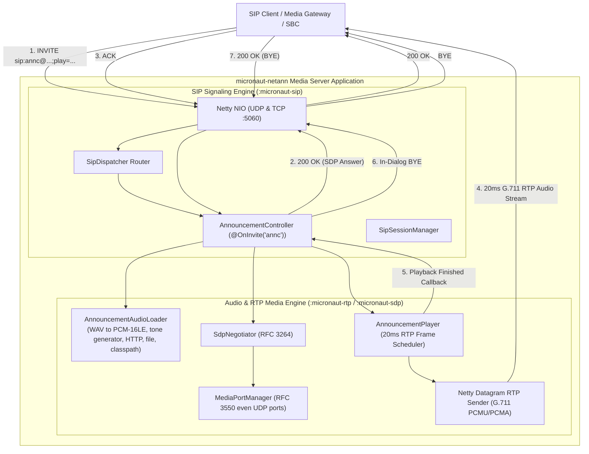
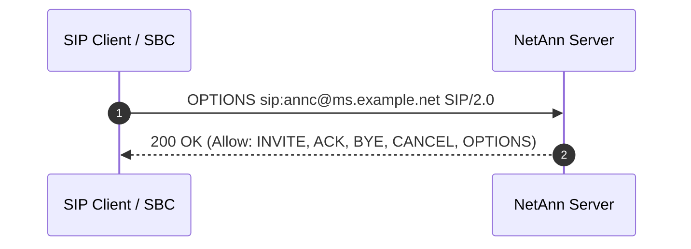

# RFC 4240 NetAnn Announcement Service: Architecture & Call Flows

`micronaut-netann` is a standalone reactive media server application built on top of `:micronaut-sip`, `:micronaut-sdp`, and `:micronaut-rtp`. It implements the **Announcement Service (`annc`)** defined by [**RFC 4240: Basic Network Media Services with SIP**](https://datatracker.ietf.org/doc/html/rfc4240).

---

## 1. Architectural Overview



---

## 2. RFC 4240 Request-URI Grammar & Parameters

The announcement service is invoked by directing an `INVITE` request to a Request-URI whose user part is `annc`:

```
sip:annc@<media-server-host>[:<port>];play=<url>[;repeat=<count>][;delay=<ms>][;duration=<ms>][;locale=<lang>][;content-type=<mime>]
```

### Supported Parameters

| Parameter | Type / Format | Default | Description | RFC Reference |
| :--- | :--- | :---: | :--- | :--- |
| `play` | URI / String | **Mandatory** | URL or prompt identifier indicating the audio content to play. Missing parameter triggers `400 Bad Request`. | RFC 4240 §3.1 |
| `repeat` | Integer / `"forever"` | `1` | Number of times the announcement should be played sequentially. Value `-1` or `"forever"` loops continuously until caller hangs up. | RFC 4240 §3.2 |
| `delay` | Long (milliseconds) | `0` | Delay between consecutive announcement repetitions in milliseconds. Zero inserts no silence between loops. | RFC 4240 §3.2 |
| `duration` | Long (milliseconds) | Unlimited | Maximum duration the media server will play before prematurely terminating the call with an in-dialog `BYE`. | RFC 4240 §3.2 |
| `locale` | RFC 3066 language code | `en` | Preferred language or regional dialect hint for selecting localized audio assets (e.g. `en-US`, `de-DE`). | RFC 4240 §3.4 |
| `content-type` | MIME type | `audio/x-wav` | MIME type hint for audio container decoding. | RFC 4240 §3.5 |

### Supported Audio Prompt Schemes (`play=`)

1. **Synthetic Tones**:
   `tone:<frequency_hz>[,<duration_ms>]` or `builtin:<frequency_hz>`
   - Example: `play=tone:440,1000` (plays a 440 Hz A-note for 1000 ms)
   - Example: `play=tone:480,500` (plays a 480 Hz tone for 500 ms)
2. **Classpath Resources**:
   `classpath:<path>` or `/prompts/<name>.wav`
   - Example: `play=classpath:prompts/welcome.wav`
3. **Provisioned Prompts**:
   `/provisioned/<id>` or `provisioned:<id>`
   - Example: `play=/provisioned/welcome`
4. **Filesystem Files**:
   `file://<path>` or direct filesystem paths
   - Example: `play=file:///var/prompts/ivr-greeting.wav`
5. **Remote HTTP / HTTPS Audio**:
   `http://<host>/<path>` or `https://<host>/<path>`
   - Example: `play=http://audio-storage.internal/announcements/system-update.wav`

All audio sources are decoded into **8000 Hz, 16-bit mono signed linear PCM** and packetized into standard **20ms frames** (160 samples per frame) encoded as **ITU-T G.711 $\mu$-law (PCMU / payload type 0)** or **A-law (PCMA / payload type 8)**.

---

## 3. NetAnn Call Flows

### Call Flow 1: Standard Announcement Playback & Server Auto-`BYE` Teardown

In accordance with RFC 4240 §2, once the requested audio prompt finishes playing, the media server automatically initiates dialog termination by sending an in-dialog `BYE` request to the client.

```mermaid
sequenceDiagram
    autonumber
    participant Client as SIP Caller / Gateway
    participant Server as NetAnn Server (micronaut-netann)
    
    Client->>Server: INVITE sip:annc@ms.example.net;play=tone:440 SIP/2.0 (with SDP Offer)
    Server-->>Client: 100 Trying (optional)
    Server->>Server: Parse play=tone:440, synthesize 8kHz PCM audio, allocate RTP port (e.g. 10002)
    Server-->>Client: 200 OK (with SDP Answer, To-tag, Contact)
    Client->>Server: ACK sip:annc@ms.example.net SIP/2.0
    Server->>Server: Transition dialog state to CONFIRMED, start 20ms RTP audio stream
    
    rect rgb(240, 248, 255)
        loop Every 20ms until audio finishes
            Server->>Client: RTP Packet (PT=0 PCMU, Seq=1..N, TS=0, 160, 320...)
        end
    end
    
    Server->>Server: Audio finished playing -> Trigger completion callback
    Server->>Client: BYE sip:caller@127.0.0.1:5060;tag=clientTag SIP/2.0
    Client-->>Server: 200 OK
    Server->>Server: Release RTP port pair, terminate dialog session
```

#### SIP Signaling Trace

**1. Client sends initial `INVITE` with SDP offer:**
```http
INVITE sip:annc@ms.example.net:5060;play=tone:440,1000 SIP/2.0
Via: SIP/2.0/UDP 127.0.0.1:5062;branch=z9hG4bK-inv-101;rport
From: <sip:caller@127.0.0.1:5062>;tag=caller-tag-1
To: <sip:annc@ms.example.net:5060>
Call-ID: annc-call-882910@127.0.0.1
CSeq: 1 INVITE
Contact: <sip:caller@127.0.0.1:5062>
Max-Forwards: 70
Content-Type: application/sdp
Content-Length: 172

v=0
o=Caller 1000 1000 IN IP4 127.0.0.1
s=VoiceCall
c=IN IP4 127.0.0.1
t=0 0
m=audio 30000 RTP/AVP 0 8
a=rtpmap:0 PCMU/8000
a=rtpmap:8 PCMA/8000
a=sendrecv
```

**2. Server responds with `200 OK` carrying SDP answer:**
```http
SIP/2.0 200 OK
Via: SIP/2.0/UDP 127.0.0.1:5062;branch=z9hG4bK-inv-101;rport=5062;received=127.0.0.1
From: <sip:caller@127.0.0.1:5062>;tag=caller-tag-1
To: <sip:annc@ms.example.net:5060>;tag=9dfa82c1b470
Call-ID: annc-call-882910@127.0.0.1
CSeq: 1 INVITE
Contact: <sip:127.0.0.1:5060;transport=udp>
Allow: INVITE, ACK, BYE, CANCEL, OPTIONS
Content-Type: application/sdp
Content-Length: 175

v=0
o=MicronautSIP 1791052800 1 IN IP4 127.0.0.1
s=MicronautNetAnn
c=IN IP4 127.0.0.1
t=0 0
m=audio 10002 RTP/AVP 0 8
a=rtpmap:0 PCMU/8000
a=rtpmap:8 PCMA/8000
a=sendrecv
```

**3. Client confirms with `ACK`:**
```http
ACK sip:annc@ms.example.net:5060 SIP/2.0
Via: SIP/2.0/UDP 127.0.0.1:5062;branch=z9hG4bK-ack-102
From: <sip:caller@127.0.0.1:5062>;tag=caller-tag-1
To: <sip:annc@ms.example.net:5060>;tag=9dfa82c1b470
Call-ID: annc-call-882910@127.0.0.1
CSeq: 1 ACK
Max-Forwards: 70
Content-Length: 0
```

**4. RTP Audio Transmission:**
- 50 consecutive UDP datagrams emitted at 20ms intervals to `127.0.0.1:30000`.
- Each datagram: 12-byte RFC 3550 RTP header + 160 bytes G.711 $\mu$-law audio payload.

**5. Server initiates teardown via in-dialog `BYE` upon completion:**
```http
BYE sip:caller@127.0.0.1:5062 SIP/2.0
Via: SIP/2.0/UDP 127.0.0.1:5060;branch=z9hG4bK-bye-991
From: <sip:annc@ms.example.net:5060>;tag=9dfa82c1b470
To: <sip:caller@127.0.0.1:5062>;tag=caller-tag-1
Call-ID: annc-call-882910@127.0.0.1
CSeq: 101 BYE
Max-Forwards: 70
Content-Length: 0
```

**6. Client returns `200 OK`:**
```http
SIP/2.0 200 OK
Via: SIP/2.0/UDP 127.0.0.1:5060;branch=z9hG4bK-bye-991
From: <sip:annc@ms.example.net:5060>;tag=9dfa82c1b470
To: <sip:caller@127.0.0.1:5062>;tag=caller-tag-1
Call-ID: annc-call-882910@127.0.0.1
CSeq: 101 BYE
Content-Length: 0
```

---

### Call Flow 2: Caller Early Teardown (`BYE` during streaming)

When a caller hangs up prior to announcement completion, the server immediately stops audio transmission, terminates background streaming threads, and frees allocated UDP port resources.

```mermaid
sequenceDiagram
    autonumber
    participant Client as SIP Caller / Gateway
    participant Server as NetAnn Server (micronaut-netann)
    
    Client->>Server: INVITE sip:annc@...;play=classpath:prompts/welcome.wav
    Server-->>Client: 200 OK (SDP Answer)
    Client->>Server: ACK
    Server->>Client: RTP Streaming (20ms packets)
    Note over Client,Server: Caller hangs up after hearing 500ms of audio
    Client->>Server: BYE sip:annc@... SIP/2.0
    Server->>Server: Cancel AnnouncementPlayer, stop RTP datagram scheduler, free port 10002
    Server-->>Client: 200 OK (BYE)
```

---

### Call Flow 3: Call Setup Cancellation (`CANCEL`)

When the caller decides to abort the call setup before the server has emitted a final response (`200 OK`), the client transmits a `CANCEL` matching the pending transaction.

```mermaid
sequenceDiagram
    autonumber
    participant Client as SIP Caller / Gateway
    participant Server as NetAnn Server (micronaut-netann)
    
    Client->>Server: INVITE sip:annc@...;play=tone:440
    Server-->>Client: 180 Ringing (Provisional)
    Client->>Server: CANCEL sip:annc@... SIP/2.0
    Server->>Server: Match pending transaction via Via branch & Call-ID
    Server-->>Client: 200 OK (to CANCEL)
    Server-->>Client: 487 Request Terminated (to INVITE)
    Client->>Server: ACK (to 487)
    Server->>Server: Clean up early session
```

---

### Call Flow 4: Repeat Loop with Inter-Prompt Delay (`repeat=3;delay=1000`)

The client requests that the announcement be repeated 3 times with 1 second (1000 ms) of silence inserted between each repetition:
`sip:annc@ms.example.net;play=tone:440,500;repeat=3;delay=1000`

```mermaid
sequenceDiagram
    autonumber
    participant Client as SIP Caller
    participant Server as NetAnn Server
    
    Client->>Server: INVITE ...;play=tone:440,500;repeat=3;delay=1000
    Server-->>Client: 200 OK (SDP Answer)
    Client->>Server: ACK
    
    rect rgb(230, 245, 230)
        Note over Server,Client: Repetition 1/3 (500ms audio)
        Server->>Client: RTP Stream (25 packets @ 20ms)
    end
    
    rect rgb(255, 250, 230)
        Note over Server,Client: Inter-repeat Delay: 1000ms Silence (50 silent RTP packets)
        Server->>Client: RTP Silence / Comfort Noise Packets
    end
    
    rect rgb(230, 245, 230)
        Note over Server,Client: Repetition 2/3 (500ms audio)
        Server->>Client: RTP Stream (25 packets @ 20ms)
    end
    
    rect rgb(255, 250, 230)
        Note over Server,Client: Inter-repeat Delay: 1000ms Silence (50 silent RTP packets)
        Server->>Client: RTP Silence / Comfort Noise Packets
    end
    
    rect rgb(230, 245, 230)
        Note over Server,Client: Repetition 3/3 (500ms audio)
        Server->>Client: RTP Stream (25 packets @ 20ms)
    end
    
    Server->>Client: BYE (Playback concluded)
    Client-->>Server: 200 OK
```

---

### Call Flow 5: Continuous Loop (`repeat=forever`)

When `repeat=forever` is declared, the announcement loops indefinitely until the caller explicitly terminates the call:

```mermaid
sequenceDiagram
    autonumber
    participant Client as SIP Caller
    participant Server as NetAnn Server
    
    Client->>Server: INVITE ...;play=tone:440,1000;repeat=forever;delay=500
    Server-->>Client: 200 OK (SDP Answer)
    Client->>Server: ACK
    
    loop Indefinitely until Caller Hangs Up
        Server->>Client: RTP Audio Stream
        Server->>Client: RTP Silence (500ms)
    end
    
    Client->>Server: BYE
    Server-->>Client: 200 OK
```

---

### Call Flow 6: Duration-Capped Playback (`duration=5000`)

When a `duration` parameter is supplied, the media server enforces a hard time ceiling. If audio playback or looping would otherwise exceed this duration, the server terminates the stream at the deadline and emits an in-dialog `BYE`.

```mermaid
sequenceDiagram
    autonumber
    participant Client as SIP Caller
    participant Server as NetAnn Server
    
    Client->>Server: INVITE ...;play=tone:440,1000;repeat=forever;duration=3000
    Server-->>Client: 200 OK (SDP Answer)
    Client->>Server: ACK
    
    Note over Server: Active duration timer = 3000ms
    Server->>Client: RTP Streaming (Loops 1..3)
    Note over Server: 3000ms deadline reached!
    
    Server->>Server: Halt streaming scheduler
    Server->>Client: BYE sip:caller@... SIP/2.0
    Client-->>Server: 200 OK
```

---

### Call Flow 7: Error Conditions & RFC 4240 Error Semantics

#### 1. Missing Mandatory `play=` Parameter (`400 Bad Request`)
Per RFC 4240 §3, the `play` parameter is mandatory for the announcement service. Any request lacking `play` is rejected immediately prior to session creation:

```http
INVITE sip:annc@ms.example.net:5060 SIP/2.0
Via: SIP/2.0/UDP 127.0.0.1:5062;branch=z9hG4bK-inv-400
...

SIP/2.0 400 Bad Request
Reason: Mandatory play parameter missing
Content-Length: 0
```

#### 2. Non-Existent Announcement Resource (`404 Not Found`)
When the requested URL, prompt identifier, or filesystem path cannot be resolved:

```http
INVITE sip:annc@ms.example.net:5060;play=file:///nonexistent/audio.wav SIP/2.0
Via: SIP/2.0/UDP 127.0.0.1:5062;branch=z9hG4bK-inv-404
...

SIP/2.0 404 Not Found
Reason: Announcement content not found
Content-Length: 0
```

#### 3. Unsupported NetAnn Service (`488 Not Acceptable Here`)
Per RFC 4240 §2, if a client requests an unhandled service indicator (e.g., `conf`, `dialog`) or an unknown user identifier:

```http
INVITE sip:conf@ms.example.net:5060;conf=1234 SIP/2.0
Via: SIP/2.0/UDP 127.0.0.1:5062;branch=z9hG4bK-inv-488
...

SIP/2.0 488 Not Acceptable Here
Reason: Unsupported NetAnn service
Content-Length: 0
```

---

### Call Flow 8: Capability Query (`OPTIONS`)

Clients or SBCs can interrogate the media server's supported methods and RFC 4240 capabilities using `OPTIONS`:



---

### Call Flow 9: Persistent TCP Signaling Transport

`micronaut-netann` transparently supports TCP signaling (RFC 3261 §18.1.1) alongside UDP. In this mode, SIP signaling messages flow over a persistent TCP stream socket, while 20ms audio frames stream asynchronously over UDP:

```mermaid
sequenceDiagram
    autonumber
    participant Client as SIP Client
    participant Server as NetAnn Server
    
    Note over Client,Server: Establish TCP Connection on Port 5060
    Client->>Server: [TCP] INVITE sip:annc@...;play=tone:440;transport=tcp
    Server-->>Client: [TCP] 200 OK (SDP Answer with audio port 10002)
    Client->>Server: [TCP] ACK
    
    rect rgb(240, 248, 255)
        loop 20ms RTP Audio
            Server->>Client: [UDP] RTP Media Packet (to negotiated client port)
        end
    end
    
    Server->>Client: [TCP] BYE
    Client-->>Server: [TCP] 200 OK
```

---

## 4. GraalVM Native Image Compilation

`micronaut-netann` is fully configured for Ahead-of-Time (AOT) GraalVM Native Image compilation with **zero reflection**, instantaneous startup, and reduced memory footprint:

- **Startup Latency**: ~15–20 ms (compared to 650 ms on JVM)
- **Idle Memory Footprint**: ~44 MB RSS (compared to 190 MB on JVM)
- **Standalone Binary**: Single executable containing the Netty networking stack, Project Reactor scheduler, audio codecs, and bundled prompts.

### Build Executable
```bash
./gradlew :micronaut-netann:nativeCompile
```

Binary location:
```bash
./micronaut-netann/build/native/nativeCompile/micronaut-netann
```

### Build Native Container
```bash
./gradlew :micronaut-netann:dockerBuildNative
```

---

## 5. Kubernetes Deployment

The application includes production-ready manifests in [`k8s/micronaut-netann/`](k8s/micronaut-netann/):

- **Deployment**: Configured with liveness (`:8080/health/liveness`), readiness (`:8080/health/readiness`), startup probes, non-root security context, and resource boundaries.
- **Service**: Exposes port `5060/UDP`, `5060/TCP`, and `8080/TCP` with `sessionAffinity: ClientIP`.
- **ConfigMap**: Configurable server names, rate limits, audio port bounds, and prompt locations.
- **Prompt Volume**: Mounted storage volume for provisioning custom corporate audio announcements.

To deploy via Kustomize:
```bash
kubectl apply -k k8s/
```
