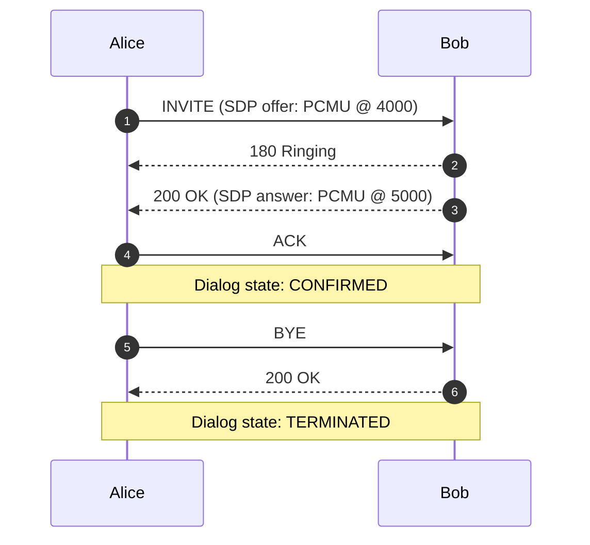
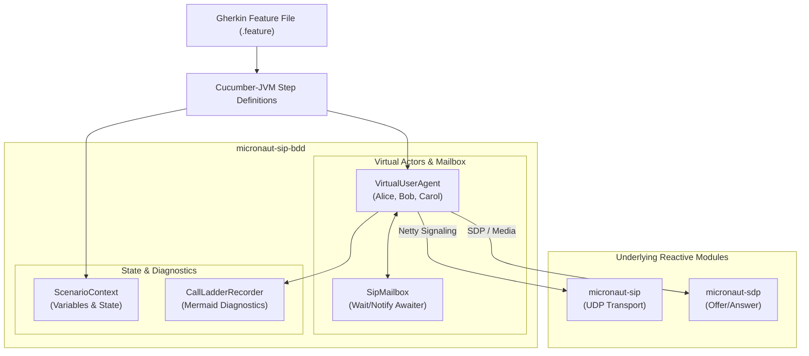

# Micronaut SIP BDD (`micronaut-sip-bdd`)

A reactive Behavior-Driven Development (BDD) and Test-Driven Development (TDD) validation library for SIP (RFC 3261) using **Gherkin** and **Cucumber-JVM**, tightly integrated with [`micronaut-sip`](../micronaut-sip), [`micronaut-sdp`](../micronaut-sdp), and [`micronaut-rtp`](../micronaut-rtp).

---

## Overview

Traditional SIP test tools (like SIPp) rely on brittle XML scenario files that are difficult to maintain and integrate into modern CI/CD pipelines. Standard JUnit unit tests require verbose asynchronous plumbing (`StepVerifier`, `CountDownLatch`, manual header/tag tracking).

`micronaut-sip-bdd` transforms RFC call ladder diagrams directly into **executable Gherkin specifications**:

```gherkin
Feature: Basic Audio Call Setup and Teardown (RFC 3261)

  Scenario: Successful two-party call between Alice and Bob
    Given a SIP endpoint "Alice"
    And a SIP endpoint "Bob"

    When "Alice" sends an "INVITE" to "Bob" with SDP offer:
      | media | proto   | port | codec |
      | audio | RTP/AVP | 4000 | PCMU  |

    Then "Bob" receives an "INVITE" request within 2 seconds
    When "Bob" responds with "180 Ringing"
    Then "Alice" receives "180 Ringing" within 2 seconds

    When "Bob" responds with "200 OK" with SDP answer:
      | media | proto   | port | codec |
      | audio | RTP/AVP | 5000 | PCMU  |

    Then "Alice" receives "200 OK" within 2 seconds
    And SDP negotiated codec is "PCMU"
    And the dialog between "Alice" and "Bob" is in state "CONFIRMED"

    When "Alice" sends an ACK to "Bob"
    When "Alice" sends a BYE to "Bob"
    Then "Bob" receives a "BYE" request within 2 seconds
    When "Bob" responds with "200 OK"
    Then "Alice" receives "200 OK" within 2 seconds
    And the dialog between "Alice" and "Bob" is in state "TERMINATED"
```



---

## Core Architecture



### Key Components

1. **`VirtualUserAgent`**:
   - Represents a participant in the test scenario (`Alice`, `Bob`, `Registrar`).
   - Binds a dedicated Netty UDP channel on an ephemeral port.
   - Manages RFC 3261 transaction headers (`Via` branch calculation, `From` tag, `CSeq` counter, `Call-ID`, `Contact`).
   - Tracks dialog state: `NONE` $\rightarrow$ `EARLY` $\rightarrow$ `CONFIRMED` $\rightarrow$ `TERMINATED`.
2. **`SipMailbox`**:
   - Thread-safe message buffer per actor.
   - Race-free predicate matching: uses synchronized `wait()` / `notifyAll()` to eliminate race conditions between rapid packet arrivals and test assertion subscriptions.
   - Supports timeout awaiters (`awaitMessage(predicate, timeout)`) and quiet period checks (`assertQuietPeriod(predicate, quietPeriod)`).
3. **`SipAuthHelper`**:
   - Implements RFC 2617 / RFC 3261 MD5 Digest Authentication.
   - Automatically computes digest responses from `WWW-Authenticate` / `Proxy-Authenticate` challenge headers on request retries.
4. **`CallLadderRecorder`**:
   - Records all sent and received messages across all virtual actors.
   - Automatically exports GitHub-compatible Mermaid sequence diagrams inside Cucumber HTML test reports and failure logs.

---

## Step Definition Cheat Sheet

### Setup & Endpoints (`Given`)
| Step | Description |
| :--- | :--- |
| `Given a SIP endpoint "{actor}"` | Creates virtual UA on `127.0.0.1` with ephemeral UDP port |
| `Given a SIP endpoint "{actor}" at "{uriOrAddress}"` | Creates virtual UA at specific URI or `host:port` |
| `Given a SIP endpoint "{actor}" listening on port {int}` | Creates virtual UA on specific UDP port |
| `Given a SIP endpoint "{actor}" with username "{u}" and password "{p}"` | Registers digest authentication credentials |
| `Given the SIP server under test is at "{host}:{port}"` | Sets destination address for the System Under Test (SUT) |

### Actions (`When`)
| Step | Description |
| :--- | :--- |
| `When "{actor}" sends an "{method}" to "{actor}"` | Sends SIP request (`INVITE`, `REGISTER`, `OPTIONS`, etc.) |
| `When "{actor}" sends an "{method}" to "{actor}" with headers:` | Sends request with custom header DataTable |
| `When "{actor}" sends an "{method}" to "{actor}" with SDP offer:` | Sends request with SDP DataTable |
| `When "{actor}" responds with "{status}"` | Sends response to last received request |
| `When "{actor}" responds with "{status}" with headers:` | Sends response with custom headers |
| `When "{actor}" responds with "{status}" with SDP answer:` | Sends response with SDP answer |
| `When "{actor}" sends an ACK to "{actor}"` | Transmits in-dialog ACK |
| `When "{actor}" sends a BYE to "{actor}"` | Transmits in-dialog BYE |
| `When "{actor}" sends PRACK acknowledging the provisional response to "{actor}"` | Transmits RFC 3262 PRACK with RAck |
| `When "{actor}" retries the last request with valid digest credentials` | Computes MD5 digest and retries challenged request |

### Assertions (`Then`)
| Step | Description |
| :--- | :--- |
| `Then "{actor}" receives "{status}" within {duration}` | Awaits SIP status code within timeout |
| `Then "{actor}" receives a/an "{method}" request within {duration}` | Awaits SIP request method within timeout |
| `Then "{actor}" receives no messages within {duration}` | Asserts quiet period (no traffic) |
| `Then header "{name}" equals "{value}"` | Verifies header exact match with variable interpolation |
| `Then header "{name}" matches regex "{regex}"` | Verifies header regex pattern match |
| `Then header "{name}" contains parameter "{param}" with value "{val}"` | Verifies parameter key-value pair |
| `Then the dialog between "{actor}" and "{actor}" is in state "{state}"` | Verifies dialog state (`CONFIRMED`, `TERMINATED`) |
| `Then SDP negotiated codec is "{codec}"` | Verifies SDP audio codec (e.g. `PCMU`) |
| `Then "{actor}" captures header "{name}" as "{variable}"` | Stores header value for later step substitution (`${variable}`) |

---

## Running BDD Scenarios

Execute all Gherkin features via Gradle:

```bash
./gradlew :micronaut-sip-bdd:test --info
```

HTML and XML test reports are generated at:
- `micronaut-sip-bdd/build/reports/tests/test/index.html`
- `micronaut-sip-bdd/build/test-results/test/`
